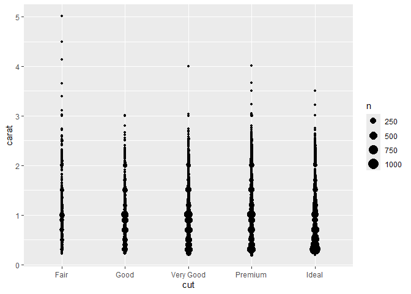

FA1: Data Visualization
================
Baybayon, Darlyn Antoinette

### 1. Case Study

``` r
library(tidyverse)
```

    ## ── Attaching core tidyverse packages ──────────────────────── tidyverse 2.0.0 ──
    ## ✔ dplyr     1.1.4     ✔ readr     2.1.5
    ## ✔ forcats   1.0.0     ✔ stringr   1.5.1
    ## ✔ ggplot2   3.5.1     ✔ tibble    3.2.1
    ## ✔ lubridate 1.9.4     ✔ tidyr     1.3.1
    ## ✔ purrr     1.0.2     
    ## ── Conflicts ────────────────────────────────────────── tidyverse_conflicts() ──
    ## ✖ dplyr::filter() masks stats::filter()
    ## ✖ dplyr::lag()    masks stats::lag()
    ## ℹ Use the conflicted package (<http://conflicted.r-lib.org/>) to force all conflicts to become errors

``` r
diamonds
```

    ## # A tibble: 53,940 × 10
    ##    carat cut       color clarity depth table price     x     y     z
    ##    <dbl> <ord>     <ord> <ord>   <dbl> <dbl> <int> <dbl> <dbl> <dbl>
    ##  1  0.23 Ideal     E     SI2      61.5    55   326  3.95  3.98  2.43
    ##  2  0.21 Premium   E     SI1      59.8    61   326  3.89  3.84  2.31
    ##  3  0.23 Good      E     VS1      56.9    65   327  4.05  4.07  2.31
    ##  4  0.29 Premium   I     VS2      62.4    58   334  4.2   4.23  2.63
    ##  5  0.31 Good      J     SI2      63.3    58   335  4.34  4.35  2.75
    ##  6  0.24 Very Good J     VVS2     62.8    57   336  3.94  3.96  2.48
    ##  7  0.24 Very Good I     VVS1     62.3    57   336  3.95  3.98  2.47
    ##  8  0.26 Very Good H     SI1      61.9    55   337  4.07  4.11  2.53
    ##  9  0.22 Fair      E     VS2      65.1    61   337  3.87  3.78  2.49
    ## 10  0.23 Very Good H     VS1      59.4    61   338  4     4.05  2.39
    ## # ℹ 53,930 more rows

### 3. Variations

#### 3.1 Discrete Variables

``` r
ggplot(data=diamonds) + geom_bar(mapping = aes(x=cut))
```

<!-- -->

Ideal is the most common diamond cut.

#### 3.2 Continuous Variables

``` r
ggplot(data=diamonds) + geom_histogram(mapping = aes(x=carat))
```

    ## `stat_bin()` using `bins = 30`. Pick better value with `binwidth`.

<!-- -->

The distribution of carats is skewed to the right. The values occur
below 3.

``` r
ggplot(data = diamonds) +
geom_histogram(mapping = aes(x = carat),binwidth = 0.01) +
coord_cartesian(xlim = c(0,3))
```

<!-- -->

Most diamonds have carat values 1 and below (0.25, 0.5, 0.75, 1). Higher
carat values are rare and expensive. Smaller diamonds are more common
and are typically used for jewelry.

### 4. Covariation

#### 4.1 Discrete vs. Discrete

``` r
ggplot(data = diamonds) +
geom_count(mapping = aes(x = cut, y = clarity))
```

<!-- -->

There appears to be a positive covariance between cut and clarity.
Better cuts seem to have more diamonds with better clarity.

#### 4.2 Continuous vs. Continuous

##### 4.2.1 Many to one

``` r
ggplot(data = diamonds) +
geom_point(mapping = aes(x = x, y = y))
```

<!-- -->

``` r
ggplot(data = diamonds) +
geom_point(mapping = aes(x = x, y = y)) +
coord_cartesian(xlim = c(3.5, 10), ylim = c(3.5,10)) +
geom_abline(slope = 1, intercept = 0, color = "red") +
coord_cartesian(xlim = c(3.5, 10), ylim = c(3.5,10))
```

    ## Coordinate system already present. Adding new coordinate system, which will
    ## replace the existing one.

<!-- -->

Lengths x and y are approximately equal for most diamonds in the dataset
might be because most of the diamonds are cut in round and square shapes
which have equal length and width.

The aes() function is used to map dataset variables to properties. slope
= 1, intercept = 0, and color = “red” are not inside aes() because these
properties specify a fixed diagonal line that is not dependent on the
dataset.

##### 4.2.2 One to One

``` r
avg_price_by_carat <- diamonds %>%
mutate(carat = round(carat, 1)) %>%
group_by(carat) %>%
summarise(avg_price = mean(price))
avg_price_by_carat
```

    ## # A tibble: 38 × 2
    ##    carat avg_price
    ##    <dbl>     <dbl>
    ##  1   0.2      506.
    ##  2   0.3      709.
    ##  3   0.4      936.
    ##  4   0.5     1590.
    ##  5   0.6     1861.
    ##  6   0.7     2619.
    ##  7   0.8     2998.
    ##  8   0.9     3942.
    ##  9   1       5437.
    ## 10   1.1     6011.
    ## # ℹ 28 more rows

``` r
ggplot(data = avg_price_by_carat) +
geom_line(mapping = aes(x = carat, y = avg_price))
```

<!-- -->

What is the relationship between average price and carat? Does this make
sense

#### 4.3 Continuous vs. Discrete

``` r
ggplot(data = diamonds)+
  geom_boxplot(mapping= aes(x=cut, y=price))
```

<!-- -->

Those thick black lines in the middle denote the median price for each
cut. What trend do we observe in the median price based as the cut
improves? Is this what you would have expected?

Better cuts appear to have lower prices. I assume more refined cuts
might result to lighter and smaller diamonds which are commonly used for
jewelry. Carat weight may be the more significant factor in pricing
diamonds, so it would make sense why ideal cut diamonds are less
expensive than others.

#### 4.4 Correlation Matrices

``` r
library(stats)

corrmat <- cor(diamonds[, c("table", "price", "z", "y", "carat", "x", "depth")], use = "complete.obs")
corrmat
```

    ##            table      price          z           y      carat           x
    ## table  1.0000000  0.1271339 0.15092869  0.18376015 0.18161755  0.19534428
    ## price  0.1271339  1.0000000 0.86124944  0.86542090 0.92159130  0.88443516
    ## z      0.1509287  0.8612494 1.00000000  0.95200572 0.95338738  0.97077180
    ## y      0.1837601  0.8654209 0.95200572  1.00000000 0.95172220  0.97470148
    ## carat  0.1816175  0.9215913 0.95338738  0.95172220 1.00000000  0.97509423
    ## x      0.1953443  0.8844352 0.97077180  0.97470148 0.97509423  1.00000000
    ## depth -0.2957785 -0.0106474 0.09492388 -0.02934067 0.02822431 -0.02528925
    ##             depth
    ## table -0.29577852
    ## price -0.01064740
    ## z      0.09492388
    ## y     -0.02934067
    ## carat  0.02822431
    ## x     -0.02528925
    ## depth  1.00000000

``` r
library(ggcorrplot)
ggcorrplot(corrmat, lab=TRUE, hc.order = TRUE)
```

<!-- -->

### 5 Additional visualization tools

#### 5.1 Axis transformation

``` r
ggplot(data = diamonds) +
geom_histogram(aes(x = carat), binwidth = 0.01)
```

<!-- -->

``` r
ggplot(data = diamonds) +
geom_histogram(aes(x = carat), binwidth = 0.01) +
scale_x_log10()
```

<!-- -->

``` r
ggplot(data = diamonds) +
geom_point(aes(x = carat, y = price)) +
scale_x_log10() +
scale_y_log10()
```

<!-- -->

#### 5.2 Multiple geoms in the same plot

``` r
ggplot(data = avg_price_by_carat) +
geom_line(mapping = aes(x = carat, y = avg_price)) +
geom_point(mapping = aes(x = carat, y = avg_price))
```

<!-- -->

``` r
ggplot(data = avg_price_by_carat, mapping = aes(x = carat, y = avg_price)) +
geom_line() +
geom_point()
```

<!-- -->

#### 5.3 Multiple aesthetics in the same geom

``` r
ggplot(data = diamonds) +
geom_point(mapping = aes(x = carat, y = price))
```

<!-- -->

``` r
ggplot(data = diamonds) +
geom_point(mapping = aes(x = carat, y = price, color = cut))
```

<!-- -->

#### 5.4 Faceting

``` r
ggplot(data=diamonds) + 
  geom_point(mapping = aes(x = carat, y = price)) +
  facet_wrap(~cut)
```

<!-- -->

``` r
ggplot(data=diamonds) + 
  geom_point(mapping = aes(x = carat, y = price)) +
  facet_grid(. ~cut)
```

<!-- -->

``` r
ggplot(data=diamonds)+
 geom_point(mapping=aes(x=carat,y=price))+
 facet_grid(clarity~cut)
```

<!-- -->

### 7 Exercises

#### 7.1 Relating the carat and cut of a diamond

The plot from 5.3 shows that lower carat weights appear to have better
cuts. Quality of cuts in lower carat weights might be prioritized as
they are commonly preferred for jewelry over larger diamonds. To
directly visualize this relationship refer to the plot below.

``` r
ggplot(data = diamonds) +
geom_count(mapping = aes(x = cut, y = carat))
```

<!-- -->

This explains the trend in the plot from 4.3. Because lower carat
weights have better cuts, ideal cut diamonds are generally less
expensive.

#### 7.2 Relating the size and carat of a diamond

``` r
ggplot(data= diamonds) + geom_point(mapping = aes(x=carat, y=y))
```

<!-- -->

``` r
# zoom in
ggplot(data= diamonds) + geom_point(mapping = aes(x=carat, y=y)) +
  coord_cartesian(xlim=c(0,5), ylim=c(3,10))
```

<!-- -->

The plot suggests that the diamond size and carat have a positive
covariance as they increase together. Carat measures the physical weight
of diamonds so naturally, bigger diamonds would have higher mass and
carat weight.
