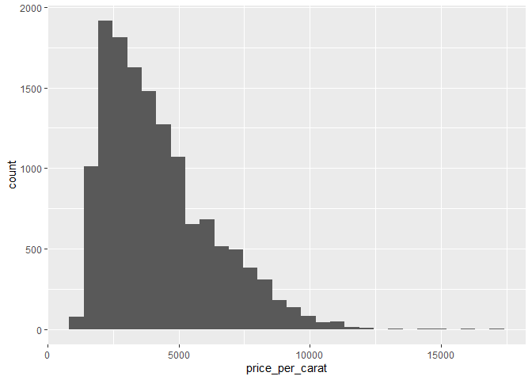

FA1: Data Transformation
================
Baybayon, Darlyn Antoinette

### 1 Introduction

``` r
library(tidyverse)
```

    ## ── Attaching core tidyverse packages ──────────────────────── tidyverse 2.0.0 ──
    ## ✔ dplyr     1.1.4     ✔ readr     2.1.5
    ## ✔ forcats   1.0.0     ✔ stringr   1.5.1
    ## ✔ ggplot2   3.5.1     ✔ tibble    3.2.1
    ## ✔ lubridate 1.9.4     ✔ tidyr     1.3.1
    ## ✔ purrr     1.0.2     
    ## ── Conflicts ────────────────────────────────────────── tidyverse_conflicts() ──
    ## ✖ dplyr::filter() masks stats::filter()
    ## ✖ dplyr::lag()    masks stats::lag()
    ## ℹ Use the conflicted package (<http://conflicted.r-lib.org/>) to force all conflicts to become errors

``` r
diamonds
```

    ## # A tibble: 53,940 × 10
    ##    carat cut       color clarity depth table price     x     y     z
    ##    <dbl> <ord>     <ord> <ord>   <dbl> <dbl> <int> <dbl> <dbl> <dbl>
    ##  1  0.23 Ideal     E     SI2      61.5    55   326  3.95  3.98  2.43
    ##  2  0.21 Premium   E     SI1      59.8    61   326  3.89  3.84  2.31
    ##  3  0.23 Good      E     VS1      56.9    65   327  4.05  4.07  2.31
    ##  4  0.29 Premium   I     VS2      62.4    58   334  4.2   4.23  2.63
    ##  5  0.31 Good      J     SI2      63.3    58   335  4.34  4.35  2.75
    ##  6  0.24 Very Good J     VVS2     62.8    57   336  3.94  3.96  2.48
    ##  7  0.24 Very Good I     VVS1     62.3    57   336  3.95  3.98  2.47
    ##  8  0.26 Very Good H     SI1      61.9    55   337  4.07  4.11  2.53
    ##  9  0.22 Fair      E     VS2      65.1    61   337  3.87  3.78  2.49
    ## 10  0.23 Very Good H     VS1      59.4    61   338  4     4.05  2.39
    ## # ℹ 53,930 more rows

### 2 Isolating Data

#### 2.1 filter()

``` r
# subset diamonds priced >=10,000
filter(diamonds, price >= 10000)
```

    ## # A tibble: 5,223 × 10
    ##    carat cut       color clarity depth table price     x     y     z
    ##    <dbl> <ord>     <ord> <ord>   <dbl> <dbl> <int> <dbl> <dbl> <dbl>
    ##  1  1.51 Good      H     VS2      64      59 10000  7.25  7.19  4.62
    ##  2  1.7  Ideal     J     VS2      60.5    58 10002  7.73  7.74  4.68
    ##  3  1.03 Ideal     E     VVS2     60.6    59 10003  6.5   6.53  3.95
    ##  4  1.23 Very Good G     VVS2     60.6    55 10004  6.93  7.02  4.23
    ##  5  1.25 Ideal     F     VS2      61.6    55 10006  6.93  6.96  4.28
    ##  6  2.01 Very Good I     SI2      61.4    63 10009  8.19  7.96  4.96
    ##  7  1.21 Very Good F     VS1      62.3    58 10009  6.76  6.85  4.24
    ##  8  1.51 Premium   I     VS2      59.9    60 10010  7.42  7.36  4.43
    ##  9  1.01 Fair      D     SI2      64.6    58 10011  6.25  6.2   4.02
    ## 10  1.05 Ideal     F     VVS2     60.5    55 10011  6.67  6.58  4.01
    ## # ℹ 5,213 more rows

``` r
# subset diamonds priced >=10,000 and clarity vvs1 or IF
filter(diamonds, price >= 10000 & clarity %in% c("VVS1", "IF"))
```

    ## # A tibble: 415 × 10
    ##    carat cut       color clarity depth table price     x     y     z
    ##    <dbl> <ord>     <ord> <ord>   <dbl> <dbl> <int> <dbl> <dbl> <dbl>
    ##  1  1.01 Very Good F     VVS1     62.9    57 10019  6.35  6.41  4.01
    ##  2  1.02 Very Good E     IF       61.7    60 10029  6.38  6.52  3.98
    ##  3  1.03 Very Good F     IF       62.8    57 10032  6.4   6.47  4.04
    ##  4  1    Very Good F     IF       63.2    63 10046  6.26  6.24  3.95
    ##  5  1.11 Ideal     G     IF       61.2    54 10053  6.71  6.73  4.11
    ##  6  1    Ideal     F     VVS1     62.3    53 10058  6.37  6.43  3.99
    ##  7  1.09 Premium   G     IF       61.3    58 10065  6.64  6.6   4.06
    ##  8  1.11 Very Good F     VVS1     62.5    59 10069  6.59  6.63  4.13
    ##  9  1.16 Ideal     G     IF       62.3    55 10082  6.79  6.73  4.21
    ## 10  1.16 Ideal     G     IF       62      57 10082  6.73  6.7   4.16
    ## # ℹ 405 more rows

#### 2.2 select()

``` r
# select corresponding to 4 Cs
select(diamonds,carat,cut,color,clarity)
```

    ## # A tibble: 53,940 × 4
    ##    carat cut       color clarity
    ##    <dbl> <ord>     <ord> <ord>  
    ##  1  0.23 Ideal     E     SI2    
    ##  2  0.21 Premium   E     SI1    
    ##  3  0.23 Good      E     VS1    
    ##  4  0.29 Premium   I     VS2    
    ##  5  0.31 Good      J     SI2    
    ##  6  0.24 Very Good J     VVS2   
    ##  7  0.24 Very Good I     VVS1   
    ##  8  0.26 Very Good H     SI1    
    ##  9  0.22 Fair      E     VS2    
    ## 10  0.23 Very Good H     VS1    
    ## # ℹ 53,930 more rows

#### 2.3 arrange()

``` r
# sort by carat asc
arrange(diamonds, carat)
```

    ## # A tibble: 53,940 × 10
    ##    carat cut       color clarity depth table price     x     y     z
    ##    <dbl> <ord>     <ord> <ord>   <dbl> <dbl> <int> <dbl> <dbl> <dbl>
    ##  1   0.2 Premium   E     SI2      60.2    62   345  3.79  3.75  2.27
    ##  2   0.2 Premium   E     VS2      59.8    62   367  3.79  3.77  2.26
    ##  3   0.2 Premium   E     VS2      59      60   367  3.81  3.78  2.24
    ##  4   0.2 Premium   E     VS2      61.1    59   367  3.81  3.78  2.32
    ##  5   0.2 Premium   E     VS2      59.7    62   367  3.84  3.8   2.28
    ##  6   0.2 Ideal     E     VS2      59.7    55   367  3.86  3.84  2.3 
    ##  7   0.2 Premium   F     VS2      62.6    59   367  3.73  3.71  2.33
    ##  8   0.2 Ideal     D     VS2      61.5    57   367  3.81  3.77  2.33
    ##  9   0.2 Very Good E     VS2      63.4    59   367  3.74  3.71  2.36
    ## 10   0.2 Ideal     E     VS2      62.2    57   367  3.76  3.73  2.33
    ## # ℹ 53,930 more rows

``` r
# sort by carat desc
arrange(diamonds, desc(carat))
```

    ## # A tibble: 53,940 × 10
    ##    carat cut       color clarity depth table price     x     y     z
    ##    <dbl> <ord>     <ord> <ord>   <dbl> <dbl> <int> <dbl> <dbl> <dbl>
    ##  1  5.01 Fair      J     I1       65.5    59 18018 10.7  10.5   6.98
    ##  2  4.5  Fair      J     I1       65.8    58 18531 10.2  10.2   6.72
    ##  3  4.13 Fair      H     I1       64.8    61 17329 10     9.85  6.43
    ##  4  4.01 Premium   I     I1       61      61 15223 10.1  10.1   6.17
    ##  5  4.01 Premium   J     I1       62.5    62 15223 10.0   9.94  6.24
    ##  6  4    Very Good I     I1       63.3    58 15984 10.0   9.94  6.31
    ##  7  3.67 Premium   I     I1       62.4    56 16193  9.86  9.81  6.13
    ##  8  3.65 Fair      H     I1       67.1    53 11668  9.53  9.48  6.38
    ##  9  3.51 Premium   J     VS2      62.5    59 18701  9.66  9.63  6.03
    ## 10  3.5  Ideal     H     I1       62.8    57 12587  9.65  9.59  6.03
    ## # ℹ 53,930 more rows

### 3 Deriving information

#### 3.1 mutate()

``` r
# add col price per carat of each diamond
mutate(diamonds, price_per_carat = price/carat)
```

    ## # A tibble: 53,940 × 11
    ##    carat cut   color clarity depth table price     x     y     z price_per_carat
    ##    <dbl> <ord> <ord> <ord>   <dbl> <dbl> <int> <dbl> <dbl> <dbl>           <dbl>
    ##  1  0.23 Ideal E     SI2      61.5    55   326  3.95  3.98  2.43           1417.
    ##  2  0.21 Prem… E     SI1      59.8    61   326  3.89  3.84  2.31           1552.
    ##  3  0.23 Good  E     VS1      56.9    65   327  4.05  4.07  2.31           1422.
    ##  4  0.29 Prem… I     VS2      62.4    58   334  4.2   4.23  2.63           1152.
    ##  5  0.31 Good  J     SI2      63.3    58   335  4.34  4.35  2.75           1081.
    ##  6  0.24 Very… J     VVS2     62.8    57   336  3.94  3.96  2.48           1400 
    ##  7  0.24 Very… I     VVS1     62.3    57   336  3.95  3.98  2.47           1400 
    ##  8  0.26 Very… H     SI1      61.9    55   337  4.07  4.11  2.53           1296.
    ##  9  0.22 Fair  E     VS2      65.1    61   337  3.87  3.78  2.49           1532.
    ## 10  0.23 Very… H     VS1      59.4    61   338  4     4.05  2.39           1470.
    ## # ℹ 53,930 more rows

``` r
# add col indicating price per carat >= 10,000
mutate(diamonds, fancy_diamond = price/carat > 10000)
```

    ## # A tibble: 53,940 × 11
    ##    carat cut     color clarity depth table price     x     y     z fancy_diamond
    ##    <dbl> <ord>   <ord> <ord>   <dbl> <dbl> <int> <dbl> <dbl> <dbl> <lgl>        
    ##  1  0.23 Ideal   E     SI2      61.5    55   326  3.95  3.98  2.43 FALSE        
    ##  2  0.21 Premium E     SI1      59.8    61   326  3.89  3.84  2.31 FALSE        
    ##  3  0.23 Good    E     VS1      56.9    65   327  4.05  4.07  2.31 FALSE        
    ##  4  0.29 Premium I     VS2      62.4    58   334  4.2   4.23  2.63 FALSE        
    ##  5  0.31 Good    J     SI2      63.3    58   335  4.34  4.35  2.75 FALSE        
    ##  6  0.24 Very G… J     VVS2     62.8    57   336  3.94  3.96  2.48 FALSE        
    ##  7  0.24 Very G… I     VVS1     62.3    57   336  3.95  3.98  2.47 FALSE        
    ##  8  0.26 Very G… H     SI1      61.9    55   337  4.07  4.11  2.53 FALSE        
    ##  9  0.22 Fair    E     VS2      65.1    61   337  3.87  3.78  2.49 FALSE        
    ## 10  0.23 Very G… H     VS1      59.4    61   338  4     4.05  2.39 FALSE        
    ## # ℹ 53,930 more rows

``` r
# if else for two cases
mutate(diamonds,
       good_value = 
         if_else(
           condition = carat > 2,
           true = price < 5000,
           false = price < 1000
         ))
```

    ## # A tibble: 53,940 × 11
    ##    carat cut       color clarity depth table price     x     y     z good_value
    ##    <dbl> <ord>     <ord> <ord>   <dbl> <dbl> <int> <dbl> <dbl> <dbl> <lgl>     
    ##  1  0.23 Ideal     E     SI2      61.5    55   326  3.95  3.98  2.43 TRUE      
    ##  2  0.21 Premium   E     SI1      59.8    61   326  3.89  3.84  2.31 TRUE      
    ##  3  0.23 Good      E     VS1      56.9    65   327  4.05  4.07  2.31 TRUE      
    ##  4  0.29 Premium   I     VS2      62.4    58   334  4.2   4.23  2.63 TRUE      
    ##  5  0.31 Good      J     SI2      63.3    58   335  4.34  4.35  2.75 TRUE      
    ##  6  0.24 Very Good J     VVS2     62.8    57   336  3.94  3.96  2.48 TRUE      
    ##  7  0.24 Very Good I     VVS1     62.3    57   336  3.95  3.98  2.47 TRUE      
    ##  8  0.26 Very Good H     SI1      61.9    55   337  4.07  4.11  2.53 TRUE      
    ##  9  0.22 Fair      E     VS2      65.1    61   337  3.87  3.78  2.49 TRUE      
    ## 10  0.23 Very Good H     VS1      59.4    61   338  4     4.05  2.39 TRUE      
    ## # ℹ 53,930 more rows

``` r
# case for more than 2 cases
mutate(diamonds,
       value = case_when(
         carat > 2 & price < 5000 ~ "good",
         carat >1 & price < 2500 ~ "ok",
         TRUE ~ "bad"
       ))
```

    ## # A tibble: 53,940 × 11
    ##    carat cut       color clarity depth table price     x     y     z value
    ##    <dbl> <ord>     <ord> <ord>   <dbl> <dbl> <int> <dbl> <dbl> <dbl> <chr>
    ##  1  0.23 Ideal     E     SI2      61.5    55   326  3.95  3.98  2.43 bad  
    ##  2  0.21 Premium   E     SI1      59.8    61   326  3.89  3.84  2.31 bad  
    ##  3  0.23 Good      E     VS1      56.9    65   327  4.05  4.07  2.31 bad  
    ##  4  0.29 Premium   I     VS2      62.4    58   334  4.2   4.23  2.63 bad  
    ##  5  0.31 Good      J     SI2      63.3    58   335  4.34  4.35  2.75 bad  
    ##  6  0.24 Very Good J     VVS2     62.8    57   336  3.94  3.96  2.48 bad  
    ##  7  0.24 Very Good I     VVS1     62.3    57   336  3.95  3.98  2.47 bad  
    ##  8  0.26 Very Good H     SI1      61.9    55   337  4.07  4.11  2.53 bad  
    ##  9  0.22 Fair      E     VS2      65.1    61   337  3.87  3.78  2.49 bad  
    ## 10  0.23 Very Good H     VS1      59.4    61   338  4     4.05  2.39 bad  
    ## # ℹ 53,930 more rows

#### 3.2 summarise()

``` r
# find the number of fancy diamonds
summarise(diamonds, num_fancy_diamonds = sum(price/carat > 10000))
```

    ## # A tibble: 1 × 1
    ##   num_fancy_diamonds
    ##                <int>
    ## 1                617

``` r
# find no. of fancy diamond and price mean of a diamond
summarise(diamonds,
          num_fancy_diamonds = sum(price/carat > 10000),
          mean_diamond_price = mean(price))
```

    ## # A tibble: 1 × 2
    ##   num_fancy_diamonds mean_diamond_price
    ##                <int>              <dbl>
    ## 1                617              3933.

Exercise: Use summarise to determine if there are any diamonds of at
least one carat that cost less than \$1000

``` r
summarise(diamonds,
          x= sum(price < 1000 & carat > 1)
          )
```

    ## # A tibble: 1 × 1
    ##       x
    ##   <int>
    ## 1     0

### 4 Multi-step transformations

#### 4.1 The pipe (%\>%)

``` r
diamonds %>%
  filter(cut == "Premium") %>%
  mutate(price_per_carat = price/carat) %>%
  arrange(desc(price_per_carat))
```

    ## # A tibble: 13,791 × 11
    ##    carat cut   color clarity depth table price     x     y     z price_per_carat
    ##    <dbl> <ord> <ord> <ord>   <dbl> <dbl> <int> <dbl> <dbl> <dbl>           <dbl>
    ##  1  1.07 Prem… D     IF       60.9    58 18279  6.67  6.57  4.03          17083.
    ##  2  1.01 Prem… D     IF       61.6    56 16234  6.46  6.43  3.97          16073.
    ##  3  1.02 Prem… D     IF       61.5    60 15370  6.52  6.45  3.99          15069.
    ##  4  1.04 Prem… D     IF       60.6    56 15671  6.6   6.54  3.98          15068.
    ##  5  1.02 Prem… D     IF       61.5    60 15231  6.45  6.52  3.99          14932.
    ##  6  1.21 Prem… D     VVS1     60.1    59 17192  6.96  6.88  4.16          14208.
    ##  7  1.31 Prem… D     VVS1     62.8    55 17496  7.01  6.95  4.38          13356.
    ##  8  1.34 Prem… E     IF       61.8    58 17663  7.15  7.08  4.4           13181.
    ##  9  1.2  Prem… D     VVS1     62.1    59 15686  0     0     0             13072.
    ## 10  1.28 Prem… E     IF       59.8    59 15806  7.1   7.07  4.24          12348.
    ## # ℹ 13,781 more rows

``` r
diamonds %>%
  filter(cut == "Premium") %>%
  mutate(price_per_carat = price/carat) %>%
  ggplot() +
  geom_histogram(aes(x = price_per_carat))
```

    ## `stat_bin()` using `bins = 30`. Pick better value with `binwidth`.

<!-- -->

Exercise: Compute the mean price for diamonds of volume at least one
carat.

#### 4.2 group_by()

``` r
diamonds %>%
  group_by(cut) %>%
  summarise(max_price = max(price))
```

    ## # A tibble: 5 × 2
    ##   cut       max_price
    ##   <ord>         <int>
    ## 1 Fair          18574
    ## 2 Good          18788
    ## 3 Very Good     18818
    ## 4 Premium       18823
    ## 5 Ideal         18806

``` r
diamonds %>%
  group_by(cut, clarity) %>%
  summarise(max_price = max(price))
```

    ## `summarise()` has grouped output by 'cut'. You can override using the `.groups`
    ## argument.

    ## # A tibble: 40 × 3
    ## # Groups:   cut [5]
    ##    cut   clarity max_price
    ##    <ord> <ord>       <int>
    ##  1 Fair  I1          18531
    ##  2 Fair  SI2         18308
    ##  3 Fair  SI1         18574
    ##  4 Fair  VS2         18565
    ##  5 Fair  VS1         17995
    ##  6 Fair  VVS2        16364
    ##  7 Fair  VVS1        12648
    ##  8 Fair  IF           3205
    ##  9 Good  I1          11548
    ## 10 Good  SI2         18788
    ## # ℹ 30 more rows

``` r
diamonds %>%
  group_by(cut, clarity) %>%
  summarise(max_price = max(price))%>%
  ungroup()
```

    ## `summarise()` has grouped output by 'cut'. You can override using the `.groups`
    ## argument.

    ## # A tibble: 40 × 3
    ##    cut   clarity max_price
    ##    <ord> <ord>       <int>
    ##  1 Fair  I1          18531
    ##  2 Fair  SI2         18308
    ##  3 Fair  SI1         18574
    ##  4 Fair  VS2         18565
    ##  5 Fair  VS1         17995
    ##  6 Fair  VVS2        16364
    ##  7 Fair  VVS1        12648
    ##  8 Fair  IF           3205
    ##  9 Good  I1          11548
    ## 10 Good  SI2         18788
    ## # ℹ 30 more rows

``` r
count(diamonds, cut)
```

    ## # A tibble: 5 × 2
    ##   cut           n
    ##   <ord>     <int>
    ## 1 Fair       1610
    ## 2 Good       4906
    ## 3 Very Good 12082
    ## 4 Premium   13791
    ## 5 Ideal     21551

#### 4.3 Storing the transformed data

``` r
diamonds
```

    ## # A tibble: 53,940 × 10
    ##    carat cut       color clarity depth table price     x     y     z
    ##    <dbl> <ord>     <ord> <ord>   <dbl> <dbl> <int> <dbl> <dbl> <dbl>
    ##  1  0.23 Ideal     E     SI2      61.5    55   326  3.95  3.98  2.43
    ##  2  0.21 Premium   E     SI1      59.8    61   326  3.89  3.84  2.31
    ##  3  0.23 Good      E     VS1      56.9    65   327  4.05  4.07  2.31
    ##  4  0.29 Premium   I     VS2      62.4    58   334  4.2   4.23  2.63
    ##  5  0.31 Good      J     SI2      63.3    58   335  4.34  4.35  2.75
    ##  6  0.24 Very Good J     VVS2     62.8    57   336  3.94  3.96  2.48
    ##  7  0.24 Very Good I     VVS1     62.3    57   336  3.95  3.98  2.47
    ##  8  0.26 Very Good H     SI1      61.9    55   337  4.07  4.11  2.53
    ##  9  0.22 Fair      E     VS2      65.1    61   337  3.87  3.78  2.49
    ## 10  0.23 Very Good H     VS1      59.4    61   338  4     4.05  2.39
    ## # ℹ 53,930 more rows

``` r
max_prices <- diamonds %>%
  group_by(cut) %>%
  summarise(max_price = max(price))
max_prices
```

    ## # A tibble: 5 × 2
    ##   cut       max_price
    ##   <ord>         <int>
    ## 1 Fair          18574
    ## 2 Good          18788
    ## 3 Very Good     18818
    ## 4 Premium       18823
    ## 5 Ideal         18806

### Exercises

1.  What is the minimum diamond price in this dataset?

``` r
min(diamonds$price)
```

    ## [1] 326

2.  How many diamonds have length at least one and a half times their
    width?

``` r
n <- diamonds %>%
  filter(x >= 1.5 * y)
count(n)
```

    ## # A tibble: 1 × 1
    ##       n
    ##   <int>
    ## 1    10

3.  Among diamonds with colors D,E,F,G, what is the median number of
    carats for diamonds of each cut?

``` r
diamonds %>%
  filter(color %in% c("D", "E", "F", "G")) %>%
  group_by(cut) %>%
  summarise(median_carat = median(carat, na.rm = TRUE))
```

    ## # A tibble: 5 × 2
    ##   cut       median_carat
    ##   <ord>            <dbl>
    ## 1 Fair              0.91
    ## 2 Good              0.72
    ## 3 Very Good         0.7 
    ## 4 Premium           0.71
    ## 5 Ideal             0.52
