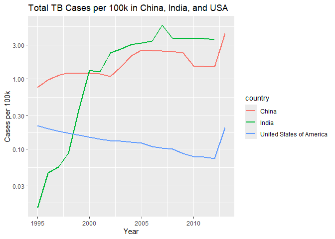
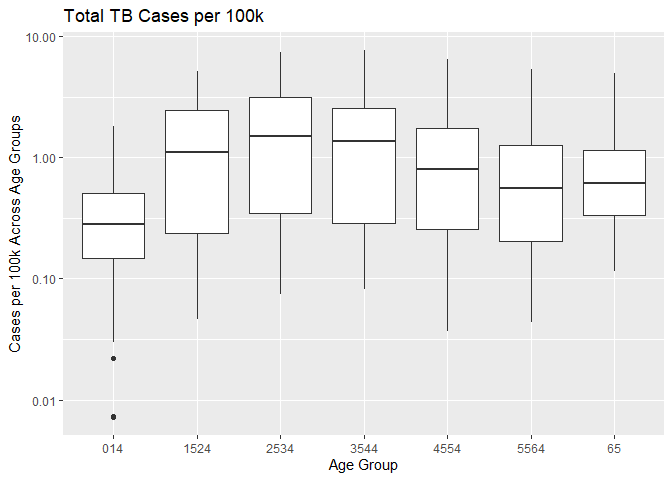
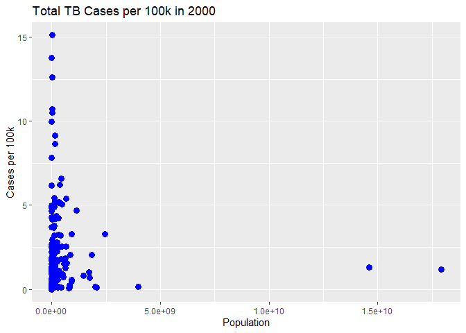

DSC1107 \| FA2
================
Baybayon, Darlyn Antoinette

### 1. Introduction

##### Required Library

``` r
library(tidyverse)
```

    ## ── Attaching core tidyverse packages ──────────────────────── tidyverse 2.0.0 ──
    ## ✔ dplyr     1.1.4     ✔ readr     2.1.5
    ## ✔ forcats   1.0.0     ✔ stringr   1.5.1
    ## ✔ ggplot2   3.5.1     ✔ tibble    3.2.1
    ## ✔ lubridate 1.9.4     ✔ tidyr     1.3.1
    ## ✔ purrr     1.0.2     
    ## ── Conflicts ────────────────────────────────────────── tidyverse_conflicts() ──
    ## ✖ dplyr::filter() masks stats::filter()
    ## ✖ dplyr::lag()    masks stats::lag()
    ## ℹ Use the conflicted package (<http://conflicted.r-lib.org/>) to force all conflicts to become errors

### 2. Import

2.1. Preview the contents of who.tsv and population.csv by inspecting
the files.

2.2. Import the data into tibbles named who and population.

2.3. Determine the number of rows and columns in each tibble.

2.4. Check the summary of variable types for population.csv. Fix any
anomalies and store the corrected data in population2.

``` r
print(who)
```

    ## # A tibble: 7,240 × 60
    ##    country  iso2  iso3   year new_sp_m014 new_sp_m1524 new_sp_m2534 new_sp_m3544
    ##    <chr>    <chr> <chr> <dbl>       <dbl>        <dbl>        <dbl>        <dbl>
    ##  1 Afghani… AF    AFG    1980          NA           NA           NA           NA
    ##  2 Afghani… AF    AFG    1981          NA           NA           NA           NA
    ##  3 Afghani… AF    AFG    1982          NA           NA           NA           NA
    ##  4 Afghani… AF    AFG    1983          NA           NA           NA           NA
    ##  5 Afghani… AF    AFG    1984          NA           NA           NA           NA
    ##  6 Afghani… AF    AFG    1985          NA           NA           NA           NA
    ##  7 Afghani… AF    AFG    1986          NA           NA           NA           NA
    ##  8 Afghani… AF    AFG    1987          NA           NA           NA           NA
    ##  9 Afghani… AF    AFG    1988          NA           NA           NA           NA
    ## 10 Afghani… AF    AFG    1989          NA           NA           NA           NA
    ## # ℹ 7,230 more rows
    ## # ℹ 52 more variables: new_sp_m4554 <dbl>, new_sp_m5564 <dbl>,
    ## #   new_sp_m65 <dbl>, new_sp_f014 <dbl>, new_sp_f1524 <dbl>,
    ## #   new_sp_f2534 <dbl>, new_sp_f3544 <dbl>, new_sp_f4554 <dbl>,
    ## #   new_sp_f5564 <dbl>, new_sp_f65 <dbl>, new_sn_m014 <dbl>,
    ## #   new_sn_m1524 <dbl>, new_sn_m2534 <dbl>, new_sn_m3544 <dbl>,
    ## #   new_sn_m4554 <dbl>, new_sn_m5564 <dbl>, new_sn_m65 <dbl>, …

``` r
print(population)
```

    ## # A tibble: 4,060 × 3
    ##    country      year population
    ##    <chr>       <dbl>      <dbl>
    ##  1 Afghanistan  1995   17586073
    ##  2 Afghanistan  1996   18415307
    ##  3 Afghanistan  1997   19021226
    ##  4 Afghanistan  1998   19496836
    ##  5 Afghanistan  1999   19987071
    ##  6 Afghanistan  2000   20595360
    ##  7 Afghanistan  2001   21347782
    ##  8 Afghanistan  2002   22202806
    ##  9 Afghanistan  2003   23116142
    ## 10 Afghanistan  2004   24018682
    ## # ℹ 4,050 more rows

``` r
population2 <- population %>%
  drop_na(country, year, population) %>%
  mutate(year = as.integer(year))
population2
```

    ## # A tibble: 4,060 × 3
    ##    country      year population
    ##    <chr>       <int>      <dbl>
    ##  1 Afghanistan  1995   17586073
    ##  2 Afghanistan  1996   18415307
    ##  3 Afghanistan  1997   19021226
    ##  4 Afghanistan  1998   19496836
    ##  5 Afghanistan  1999   19987071
    ##  6 Afghanistan  2000   20595360
    ##  7 Afghanistan  2001   21347782
    ##  8 Afghanistan  2002   22202806
    ##  9 Afghanistan  2003   23116142
    ## 10 Afghanistan  2004   24018682
    ## # ℹ 4,050 more rows

### 3. Tidy Data

#### 3.1 WHO Dataset

3.1.1 Identify the variables in the dataset.

The variables in this dataset are country, iso2, iso3, year, and case
types.

3.1.2 Perform a pivot operation to make the data tidy, storing the
result in who2.

``` r
who2 <- who %>%
  pivot_longer(-(1:4), names_to = "name", values_to = "cases", values_drop_na = TRUE)
who2
```

    ## # A tibble: 76,046 × 6
    ##    country     iso2  iso3   year name         cases
    ##    <chr>       <chr> <chr> <dbl> <chr>        <dbl>
    ##  1 Afghanistan AF    AFG    1997 new_sp_m014      0
    ##  2 Afghanistan AF    AFG    1997 new_sp_m1524    10
    ##  3 Afghanistan AF    AFG    1997 new_sp_m2534     6
    ##  4 Afghanistan AF    AFG    1997 new_sp_m3544     3
    ##  5 Afghanistan AF    AFG    1997 new_sp_m4554     5
    ##  6 Afghanistan AF    AFG    1997 new_sp_m5564     2
    ##  7 Afghanistan AF    AFG    1997 new_sp_m65       0
    ##  8 Afghanistan AF    AFG    1997 new_sp_f014      5
    ##  9 Afghanistan AF    AFG    1997 new_sp_f1524    38
    ## 10 Afghanistan AF    AFG    1997 new_sp_f2534    36
    ## # ℹ 76,036 more rows

3.1.3 Separate values like new_ep_f014 into components (e.g., new, ep,
f014). Remove the column containing new, and store the result in who3.

``` r
who3 <- who2 %>%
  mutate(name = stringr::str_replace(name, "newrel", "new_rel"))  %>%
  separate(col=name, into=c("new", "type", "sex_age"), sep="_") %>%
  select(-new)
```

3.1.4 Further separate values like f014 into f and 014, storing the
result in who_tidy.

``` r
who_tidy <- who3 %>%
  separate(col=sex_age, into=c("sex", "age_group"), sep=1)
who_tidy
```

    ## # A tibble: 76,046 × 8
    ##    country     iso2  iso3   year type  sex   age_group cases
    ##    <chr>       <chr> <chr> <dbl> <chr> <chr> <chr>     <dbl>
    ##  1 Afghanistan AF    AFG    1997 sp    m     014           0
    ##  2 Afghanistan AF    AFG    1997 sp    m     1524         10
    ##  3 Afghanistan AF    AFG    1997 sp    m     2534          6
    ##  4 Afghanistan AF    AFG    1997 sp    m     3544          3
    ##  5 Afghanistan AF    AFG    1997 sp    m     4554          5
    ##  6 Afghanistan AF    AFG    1997 sp    m     5564          2
    ##  7 Afghanistan AF    AFG    1997 sp    m     65            0
    ##  8 Afghanistan AF    AFG    1997 sp    f     014           5
    ##  9 Afghanistan AF    AFG    1997 sp    f     1524         38
    ## 10 Afghanistan AF    AFG    1997 sp    f     2534         36
    ## # ℹ 76,036 more rows

#### 3.2 Population Dataset

3.2.1 Identify the variables in this dataset.

The variables in the dataset are country, year, and population.

3.2.2 Perform a pivot operation to tidy the data, storing the result in
population3.

3.2.3 Cast the population variable to an appropriate data type, storing
the result in population_tidy.

``` r
population_tidy <- population2 %>%
   mutate(
    population = as.integer(population)
  )
```

#### 3.3 Join Datasets

3.3.1 Identify the variable(s) required to join who_tidy and
population_tidy.

who_tidy and population_tidy can be joined by the variables country and
year.

3.3.2 Rename columns as needed to align variable names between datasets.

3.3.3 Join the datasets into a tibble called tuberculosis.

``` r
tuberculosis <- left_join(x = who_tidy, y = population_tidy, by = c("country", "year"))
tuberculosis
```

    ## # A tibble: 76,046 × 9
    ##    country     iso2  iso3   year type  sex   age_group cases population
    ##    <chr>       <chr> <chr> <dbl> <chr> <chr> <chr>     <dbl>      <int>
    ##  1 Afghanistan AF    AFG    1997 sp    m     014           0   19021226
    ##  2 Afghanistan AF    AFG    1997 sp    m     1524         10   19021226
    ##  3 Afghanistan AF    AFG    1997 sp    m     2534          6   19021226
    ##  4 Afghanistan AF    AFG    1997 sp    m     3544          3   19021226
    ##  5 Afghanistan AF    AFG    1997 sp    m     4554          5   19021226
    ##  6 Afghanistan AF    AFG    1997 sp    m     5564          2   19021226
    ##  7 Afghanistan AF    AFG    1997 sp    m     65            0   19021226
    ##  8 Afghanistan AF    AFG    1997 sp    f     014           5   19021226
    ##  9 Afghanistan AF    AFG    1997 sp    f     1524         38   19021226
    ## 10 Afghanistan AF    AFG    1997 sp    f     2534         36   19021226
    ## # ℹ 76,036 more rows

#### 3.4 Clean Up Data

3.4.1 Remove unnecessary variables from tuberculosis.

3.4.2 Filter out rows with NA values.

3.4.3 Save the cleaned data back into tuberculosis.

``` r
tuberculosis <- tuberculosis %>%
  select(-iso2, -iso3) %>%
  drop_na()

tuberculosis
```

    ## # A tibble: 75,234 × 7
    ##    country      year type  sex   age_group cases population
    ##    <chr>       <dbl> <chr> <chr> <chr>     <dbl>      <int>
    ##  1 Afghanistan  1997 sp    m     014           0   19021226
    ##  2 Afghanistan  1997 sp    m     1524         10   19021226
    ##  3 Afghanistan  1997 sp    m     2534          6   19021226
    ##  4 Afghanistan  1997 sp    m     3544          3   19021226
    ##  5 Afghanistan  1997 sp    m     4554          5   19021226
    ##  6 Afghanistan  1997 sp    m     5564          2   19021226
    ##  7 Afghanistan  1997 sp    m     65            0   19021226
    ##  8 Afghanistan  1997 sp    f     014           5   19021226
    ##  9 Afghanistan  1997 sp    f     1524         38   19021226
    ## 10 Afghanistan  1997 sp    f     2534         36   19021226
    ## # ℹ 75,224 more rows

### 4. Data Manipulation

4.1 Determine the total TB cases among men and women in the 21st century
in the United States. Identify which sex had more cases.

``` r
tuberculosis %>%
  filter(year > 2000 & country == "United States of America") %>%
  group_by(sex) %>%
  summarise(total_cases = sum(cases, na.rm = TRUE))
```

    ## # A tibble: 2 × 2
    ##   sex   total_cases
    ##   <chr>       <dbl>
    ## 1 f           43982
    ## 2 m           73769

In the 21st century in United States, males had more cases of
tuberculosis at 73,769.

4.2 Create a new variable, cases_per_100k, representing TB cases per
100,000 people by year, sex, age group, and TB type.

``` r
tuberculosis <- tuberculosis %>%
  mutate(cases_per_100k = (cases/population)*100000)
tuberculosis
```

    ## # A tibble: 75,234 × 8
    ##    country      year type  sex   age_group cases population cases_per_100k
    ##    <chr>       <dbl> <chr> <chr> <chr>     <dbl>      <int>          <dbl>
    ##  1 Afghanistan  1997 sp    m     014           0   19021226         0     
    ##  2 Afghanistan  1997 sp    m     1524         10   19021226         0.0526
    ##  3 Afghanistan  1997 sp    m     2534          6   19021226         0.0315
    ##  4 Afghanistan  1997 sp    m     3544          3   19021226         0.0158
    ##  5 Afghanistan  1997 sp    m     4554          5   19021226         0.0263
    ##  6 Afghanistan  1997 sp    m     5564          2   19021226         0.0105
    ##  7 Afghanistan  1997 sp    m     65            0   19021226         0     
    ##  8 Afghanistan  1997 sp    f     014           5   19021226         0.0263
    ##  9 Afghanistan  1997 sp    f     1524         38   19021226         0.200 
    ## 10 Afghanistan  1997 sp    f     2534         36   19021226         0.189 
    ## # ℹ 75,224 more rows

4.3 Identify: The country and year with the highest cases per 100k. The
country and year with the lowest cases per 100k.

``` r
tb_grouped <- tuberculosis %>%
  group_by(country,year) %>%
  summarise(
    total_cases = sum(cases),
    total_population = sum(population),
    .groups = "drop"
  ) %>%
  mutate(cases_per_100k = (total_cases / total_population) * 100000)
```

Country and year with lowest cases per 100k

``` r
tb_grouped %>%
  filter(cases_per_100k == min(cases_per_100k))
```

    ## # A tibble: 48 × 5
    ##    country                      year total_cases total_population cases_per_100k
    ##    <chr>                       <dbl>       <dbl>            <dbl>          <dbl>
    ##  1 Anguilla                     2004           0           172788              0
    ##  2 Anguilla                     2011           0           586152              0
    ##  3 Anguilla                     2012           0           593544              0
    ##  4 Anguilla                     2013           0           200200              0
    ##  5 Barbados                     2011           0         11835768              0
    ##  6 Barbados                     2012           0         11895282              0
    ##  7 Bermuda                      2004           0           894754              0
    ##  8 Bermuda                      2013           0           914774              0
    ##  9 Bonaire, Saint Eustatius a…  2010           0           739872              0
    ## 10 Bonaire, Saint Eustatius a…  2011           0           764148              0
    ## # ℹ 38 more rows

Country and year with highest cases per 100k

``` r
tb_grouped %>%
  filter(cases_per_100k == max(cases_per_100k))
```

    ## # A tibble: 1 × 5
    ##   country  year total_cases total_population cases_per_100k
    ##   <chr>   <dbl>       <dbl>            <dbl>          <dbl>
    ## 1 Niue     2011           1             1426           70.1

### 5. Data Visualization

5.1 Plot the total cases per 100k as a function of year for China,
India, and the United States: Use a log scale on the y-axis
(scale_y_log10()). Describe emerging patterns.

``` r
tb_filtered <- tuberculosis %>%
  filter(country %in% c("China", "India", "United States of America")) %>%
  group_by(country, year) %>%
  summarize(total_cases = sum(cases, na.rm = TRUE),
            total_population = sum(population, na.rm = TRUE),
            cases_per_100k = (total_cases / total_population) * 100000,
            .groups = "drop")

library(ggplot2)
ggplot(tb_filtered, aes(x = year, y = cases_per_100k, color = country)) +
  geom_line(linewidth = 1) +
  scale_y_log10() +
  labs(title = "Total TB Cases per 100k in China, India, and USA",
       x = "Year",
       y = "Cases per 100k")
```

<!-- -->
Cases per 100k in China and India increased over the years with India
having a more dramatic increase from 1995 to 2000. Cases in USA, on the
other hand, steadily decreased until 2010. USA also has relatively lower
cases per 100k compared to the two countries.

5.2 Compare distributions of total cases per 100k (summed over years,
sexes, and TB types) across age groups: Use a log scale on the y-axis.
Highlight observed patterns.

``` r
tb_age <- tuberculosis %>%
  group_by(age_group, year, sex, type) %>%
  summarize(
    total_cases = sum(cases, na.rm = TRUE),
    total_population = sum(population, na.rm = TRUE),
    cases_per_100k = (total_cases / total_population) * 100000,
    .groups = "drop")

ggplot(tb_age, aes(x = age_group, y = cases_per_100k)) +
  geom_boxplot() + 
  scale_y_log10() +
  labs(title = "Total TB Cases per 100k",
       x = "Age Group",
       y = "Cases per 100k Across Age Groups")
```

<!-- -->
The youngest age group appear to have the lowest median TB cases per
100k with some outliers. The median tends to get higher in middle age
groups (ages 15 to 44) with more variability in TB rates. The median
remain high for older age groups, only declining slightly compared to
the peak in middle age groups. It can be said that tuberculosis is least
common among young children and more prevalent among individuals aged 15
to 44.

5.3 Create a plot to evaluate whether the number of cases per 100k in
2000 was related to a country’s population: Conclude based on the
visualization.

``` r
tb_2000 <- tuberculosis %>%
  filter(year == 2000) %>%
  group_by(country)%>%
  summarize(
    total_cases = sum(cases, na.rm = TRUE),
    total_population = sum(population, na.rm = TRUE),
    cases_per_100k = (total_cases / total_population) * 100000,
    .groups = "drop"
  )


ggplot(tb_2000, aes(x = total_population, y = cases_per_100k)) +
  geom_point(color = "blue", size = 3) +
  labs(title = "Total TB Cases per 100k in 2000",
       x = "Population",
       y = "Cases per 100k")
```

<!-- -->

Most countries with relatively low population have a wide range of case
rates. Few highly populated countries on the far right do not show
higher case rates either. Hence, it can be concluded that there is no
significant relationship between the total cases per 100k in 2000 and
population per country.
