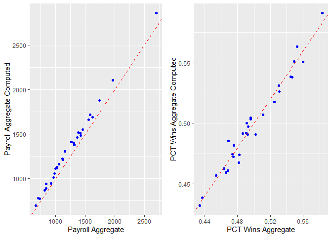
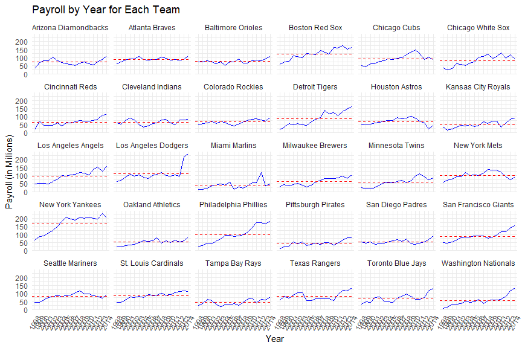
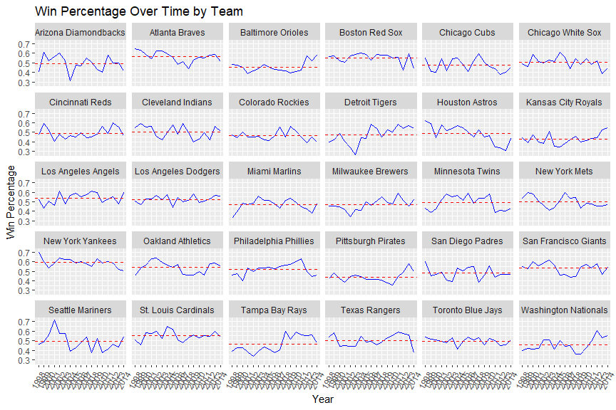
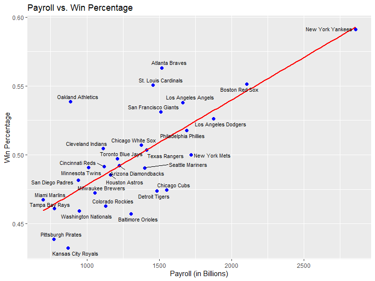

DSC1107 \| FA3
================
Baybayon, Darlyn Antoinette

### Case Study: Major League Baseball

``` r
suppressPackageStartupMessages({
  library(tidyverse)
  library(ggrepel)
  library(kableExtra)
  library(cowplot)
  library(readr)
  library(gridExtra)
})
```

#### Wrangle

##### 1.1 Import

- Import the data into a tibble called mlb_raw
- How many rows and columns does the data have?
- Does this match up with the data description given above?

**Solution**

``` r
load("ml_pay.rdata")
mlb_raw <- as_tibble(ml_pay)
print(mlb_raw)
```

    ## # A tibble: 30 × 54
    ##    payroll avgwin Team.name.2014 p1998 p1999 p2000 p2001 p2002 p2003 p2004 p2005
    ##      <dbl>  <dbl> <fct>          <dbl> <dbl> <dbl> <dbl> <dbl> <dbl> <dbl> <dbl>
    ##  1   1.12   0.490 Arizona Diamo…  31.6  70.5  81.0  81.2 103.   80.6  70.2  63.0
    ##  2   1.38   0.553 Atlanta Braves  61.7  74.9  84.5  91.9  93.5 106.   88.5  85.1
    ##  3   1.16   0.454 Baltimore Ori…  71.9  72.2  81.4  72.4  60.5  73.9  51.2  74.6
    ##  4   1.97   0.549 Boston Red Sox  59.5  71.7  77.9 110.  108.   99.9 125.  121. 
    ##  5   1.46   0.474 Chicago Cubs    49.8  42.1  60.5  64.0  75.7  79.9  91.1  87.2
    ##  6   1.32   0.511 Chicago White…  35.2  24.5  31.1  62.4  57.1  51.0  65.2  75.2
    ##  7   1.02   0.486 Cincinnati Re…  20.7  73.3  46.9  45.2  45.1  59.4  43.1  59.7
    ##  8   0.999  0.496 Cleveland Ind…  59.5  54.4  75.9  92.0  78.9  48.6  34.6  41.8
    ##  9   1.03   0.463 Colorado Rock…  47.7  55.4  61.1  71.1  56.9  67.2  64.6  47.8
    ## 10   1.43   0.482 Detroit Tigers  19.2  35.0  58.3  49.8  55.0  49.2  46.4  69.0
    ## # ℹ 20 more rows
    ## # ℹ 43 more variables: p2006 <dbl>, p2007 <dbl>, p2008 <dbl>, p2009 <dbl>,
    ## #   p2010 <dbl>, p2011 <dbl>, p2012 <dbl>, p2013 <dbl>, p2014 <dbl>,
    ## #   X2014 <int>, X2013 <int>, X2012 <int>, X2011 <int>, X2010 <int>,
    ## #   X2009 <int>, X2008 <int>, X2007 <int>, X2006 <int>, X2005 <int>,
    ## #   X2004 <int>, X2003 <int>, X2002 <int>, X2001 <int>, X2000 <int>,
    ## #   X1999 <int>, X1998 <int>, X2014.pct <dbl>, X2013.pct <dbl>, …

**There are 30 rows and 54 columns in the data which matches with the
description.**

##### 1.2 Tidy

**Solution**

``` r
mlb_aggregate <- mlb_raw %>%
  select(Team.name.2014, payroll, avgwin)%>% # select relevant columns
  rename( # rename for clarity
    team = Team.name.2014,
    payroll_aggregate = payroll,
    pct_wins_aggregate = avgwin
  )
mlb_aggregate
```

    ## # A tibble: 30 × 3
    ##    team                 payroll_aggregate pct_wins_aggregate
    ##    <fct>                            <dbl>              <dbl>
    ##  1 Arizona Diamondbacks             1.12               0.490
    ##  2 Atlanta Braves                   1.38               0.553
    ##  3 Baltimore Orioles                1.16               0.454
    ##  4 Boston Red Sox                   1.97               0.549
    ##  5 Chicago Cubs                     1.46               0.474
    ##  6 Chicago White Sox                1.32               0.511
    ##  7 Cincinnati Reds                  1.02               0.486
    ##  8 Cleveland Indians                0.999              0.496
    ##  9 Colorado Rockies                 1.03               0.463
    ## 10 Detroit Tigers                   1.43               0.482
    ## # ℹ 20 more rows

``` r
mlb_yearly <- mlb_raw %>%
  select(-payroll, -avgwin) %>% # remove irrelevant columns
  pivot_longer( # pivot to take all columns with years into a single column
    cols = matches("^p\\d{4}$|^X\\d{4}\\.pct$|^X\\d{4}$"), 
    names_to = "col_name", 
    values_to = "value", 
    values_drop_na = TRUE) %>%
  separate( # split the created column into three parts
    col = col_name, into = c("prefix", "year", "suffix"), 
    sep = "(?<=\\D)(?=\\d{4})|(?<=\\d{4})\\.", 
    fill = "right") %>%
  mutate( # create a new column which classifies the row based on the split columns
    col_class = case_when(
      prefix == "p" ~ "payroll",
      suffix == "pct" ~ "pct_wins",
      TRUE ~ "num_wins"
    )
  ) %>%
  select(team = Team.name.2014, year, col_class, value) %>% # select relevant columns
  pivot_wider( # pivot back to wider format and create separate columns based on the col_class
    names_from = col_class, values_from = value)
  
mlb_yearly
```

    ## # A tibble: 510 × 5
    ##    team                 year  payroll num_wins pct_wins
    ##    <fct>                <chr>   <dbl>    <dbl>    <dbl>
    ##  1 Arizona Diamondbacks 1998     31.6       65    0.399
    ##  2 Arizona Diamondbacks 1999     70.5      100    0.613
    ##  3 Arizona Diamondbacks 2000     81.0       85    0.525
    ##  4 Arizona Diamondbacks 2001     81.2       92    0.568
    ##  5 Arizona Diamondbacks 2002    103.        98    0.605
    ##  6 Arizona Diamondbacks 2003     80.6       84    0.519
    ##  7 Arizona Diamondbacks 2004     70.2       51    0.315
    ##  8 Arizona Diamondbacks 2005     63.0       77    0.475
    ##  9 Arizona Diamondbacks 2006     59.7       76    0.469
    ## 10 Arizona Diamondbacks 2007     52.1       90    0.552
    ## # ℹ 500 more rows

##### 1.3 Quality Control

• Create a new tibble called mlb_aggregate_computed based on aggregating
the data in mlb_yearly, containing columns named team,
payroll_aggregate_computed, and pct_wins_aggregate_computed.

• Ideally, mlb_aggregate_computed would match mlb_aggregate. To check
whether this is the case, join these two tibbles into
mlb_aggregate_joined (which should have five columns: team,
payroll_aggregate, pct_wins_aggregate, payroll_aggregate_computed, and
pct_wins_aggregate_computed.)

**Solution**

``` r
mlb_aggregate_computed <- mlb_yearly %>%
  group_by(team) %>%
  summarise(
    payroll_aggregate_computed = sum(payroll, na.rm = TRUE), # compute total payroll across 17 yrs
    pct_wins_aggregate_computed = mean(pct_wins, na.rm = TRUE) # compute mean pct wins across 17 yrs
  )

mlb_aggregate_joined <- mlb_aggregate %>% 
  left_join( # join the given aggregate and computed aggregate using left_join by col team
    mlb_aggregate_computed, by = 'team')

mlb_aggregate_joined
```

    ## # A tibble: 30 × 5
    ##    team              payroll_aggregate pct_wins_aggregate payroll_aggregate_co…¹
    ##    <fct>                         <dbl>              <dbl>                  <dbl>
    ##  1 Arizona Diamondb…             1.12               0.490                  1223.
    ##  2 Atlanta Braves                1.38               0.553                  1518.
    ##  3 Baltimore Orioles             1.16               0.454                  1305.
    ##  4 Boston Red Sox                1.97               0.549                  2104.
    ##  5 Chicago Cubs                  1.46               0.474                  1552.
    ##  6 Chicago White Sox             1.32               0.511                  1375.
    ##  7 Cincinnati Reds               1.02               0.486                  1119.
    ##  8 Cleveland Indians             0.999              0.496                  1113.
    ##  9 Colorado Rockies              1.03               0.463                  1129.
    ## 10 Detroit Tigers                1.43               0.482                  1484.
    ## # ℹ 20 more rows
    ## # ℹ abbreviated name: ¹​payroll_aggregate_computed
    ## # ℹ 1 more variable: pct_wins_aggregate_computed <dbl>

• Create scatter plots of payroll_aggregate_computed versus
payroll_aggregate and pct_wins\_ aggregate_computed versus
pct_wins_aggregate, including a 45◦ line in each. Display these scatter
plots side by side, and comment on the relationship between the computed
and provided aggregate statistics.

**Solution**

``` r
payroll_plot <- ggplot( # plot payroll aggregate vs computed
  mlb_aggregate_joined, aes(x = payroll_aggregate * 1000, y = payroll_aggregate_computed)) +
  geom_point(color = "blue") +
  geom_abline(slope = 1, intercept = 0, linetype = "dashed", color = "red") + # add line with slope of 1
  labs(
    x = "Payroll Aggregate",
    y = "Payroll Aggregate Computed"
  )

pct_wins_plot <- ggplot( # plot pct wins aggregate vs computed
  mlb_aggregate_joined, aes(x = pct_wins_aggregate, y = pct_wins_aggregate_computed)) +
  geom_point(color = "blue") + 
  geom_abline(slope = 1, intercept = 0, linetype = "dashed", color = "red") + # add line with a slope of 1
  labs(
    x = "PCT Wins Aggregate",
    y = "PCT Wins Aggregate Computed"
  )

grid.arrange(payroll_plot, pct_wins_plot, ncol = 2)
```

<!-- -->

**The scatter plots show that the given and computed payroll and win
percentage are very similar as the points lie very closely along the
straight diagonal line. There is slight discrepancy between the given
and computed data likely due to data per year being rounded off.
Computed payrolls tend to be higher than the given while discrepancy in
pct wins is more random.**

#### 2 Explore

##### 2.1 Payroll across years

• Plot payroll as a function of year for each of the 30 teams, faceting
the plot by team and adding a red dashed horizontal line for the mean
payroll across years of each team.

**Solution**

``` r
mlb_yearly %>%
  group_by(team, year) %>%
  summarise( # calculate total payroll
    total_payroll = sum(payroll, na.rm = TRUE), .groups = "drop") %>%
  group_by(team) %>%
  mutate( # calculate mean payroll
    mean_payroll = mean(total_payroll, na.rm = TRUE)) %>%
  ggplot(aes(x = year, y = total_payroll, color = team)) +
  geom_line(aes(group = team), color = "blue") +
  facet_wrap(~team) +
  # add the horizontal red dashed line for the mean payroll
  geom_hline(aes(yintercept = mean_payroll), linetype = "dashed", color = "red") +
  theme_minimal() +
  labs(
    title = "Payroll by Year for Each Team",
    x = "Year",
    y = "Payroll (in Millions)"
  )  +
  theme(axis.text.x = element_text(angle = 60, hjust = 1))
```

<!-- -->

• Using dplyr, identify the three teams with the greatest
payroll_aggregate_computed, and print a table of these teams and their
payroll_aggregate_computed.

**Solution**

``` r
mlb_aggregate_joined %>%
  select(team, payroll_aggregate_computed) %>% # select relevant columns
  arrange(desc(payroll_aggregate_computed)) %>% # arrange in desc order and display top 3
  head(3)
```

    ## # A tibble: 3 × 2
    ##   team                payroll_aggregate_computed
    ##   <fct>                                    <dbl>
    ## 1 New York Yankees                         2857.
    ## 2 Boston Red Sox                           2104.
    ## 3 Los Angeles Dodgers                      1874.

• Using dplyr, identify the three teams with the greatest percentage
increase in payroll from 1998 to 2014 (call it pct_increase), and print
a table of these teams along with pct_increase as well as their payroll
figures from 1998 and 2014.

**Solution**

``` r
mlb_yearly %>% 
  select(team, year, payroll) %>% # select relevant columns
  pivot_wider( # pivot to wider format to see payroll from different years
     names_from = year, values_from = payroll, names_prefix = "payroll_")  %>%
  mutate( # create a new column for pct_increase
    pct_increase = (payroll_2014 - payroll_1998)/payroll_1998 * 100 
  ) %>%
  select(team, payroll_1998, payroll_2014, pct_increase)%>% # select relevant columns
  arrange(desc(pct_increase)) %>% # arrange in descending order and display top 3
  head(3)
```

    ## # A tibble: 3 × 4
    ##   team                  payroll_1998 payroll_2014 pct_increase
    ##   <fct>                        <dbl>        <dbl>        <dbl>
    ## 1 Washington Nationals          8.32         135.        1520.
    ## 2 Detroit Tigers               19.2          162.         743.
    ## 3 Philadelphia Phillies        28.6          180.         529.

• How are the metrics payroll_aggregate_computed and pct_increase
reflected in the plot above, and how can we see that the two sets of
teams identified above are the top three in terms of these metrics?

**Teams with the highest total payroll . While teams with the highest
percent increase in payroll would show a steeper increase in graphs.**

##### 2.2 Win percentage across years

• Plot pct_wins as a function of year for each of the 30 teams, faceting
the plot by team and adding a red dashed horizontal line for the average
pct_wins across years of each team.

``` r
mlb_yearly %>%
  select(team, year, pct_wins) %>% # select relevant columns
  group_by(team) %>% # group by team for next operations
  mutate( # create new column by taking mean of pct_wins across 17 yrs
    avg_pct_wins = mean(pct_wins, na.rm = TRUE)) %>%  
  ungroup() %>% # ungroup before plotting
  ggplot(aes(x = year, y = pct_wins, group = team)) + # plot yr vs pct wins
  geom_line(color = "blue") +  
  geom_hline(aes(yintercept = avg_pct_wins), linetype = "dashed", color = "red") + # add red line indicating mean pct wins
  facet_wrap(~ team) +  # facet by team
  labs(
    title = "Win Percentage Over Time by Team",
    x = "Year",
    y = "Win Percentage"
  ) +
  theme(axis.text.x = element_text(angle = 60, hjust= 1)) # rotate x axis labels
```

<!-- -->

• Using dplyr, identify the three teams with the greatest
pct_wins_aggregate_computed and print a table of these teams along with
pct_wins_aggregate_computed.

**Solution**

``` r
mlb_aggregate_joined %>% 
  select(team, pct_wins_aggregate_computed) %>% # select relevant cols
  arrange(desc(pct_wins_aggregate_computed)) %>% #arrange in desc order and display top 3
  head(3)
```

    ## # A tibble: 3 × 2
    ##   team             pct_wins_aggregate_computed
    ##   <fct>                                  <dbl>
    ## 1 New York Yankees                       0.591
    ## 2 Atlanta Braves                         0.563
    ## 3 Boston Red Sox                         0.551

• Using dplyr, identify the three teams with the most erratic pct_wins
across years (as measured by the standard deviation, call it
pct_wins_sd) and print a table of these teams along with pct_wins_sd.

**Solution**

``` r
mlb_yearly %>%
  group_by(team) %>% # group by team to perform operations separately per team
  summarize(pct_wins_sd = sd(pct_wins, na.rm = TRUE)) %>% # calculate pct wins sd per team
  arrange(desc(pct_wins_sd)) %>% # arrange in desc order and display top 3
  head(3)
```

    ## # A tibble: 3 × 2
    ##   team             pct_wins_sd
    ##   <fct>                  <dbl>
    ## 1 Houston Astros        0.0914
    ## 2 Detroit Tigers        0.0898
    ## 3 Seattle Mariners      0.0892

• How are the metrics pct_wins_aggregate_computed and pct_wins_sd
reflected in the plot above, and how can we see that the two sets of
teams identified above are the top three in terms of these metrics?

**The teams with the greatest pct_wins_aggregate_computed have higher
mean pct wins as observed in the red lines in the plot. The teams with
the greatest pct_wins_sd notably have erratic graphs with many sharp
fluctuations and more unpredictable behavior.**

##### 2.3 Win percentage vs. Payroll

• Create a scatter plot of pct_wins versus payroll based on the
aggregated data, labeling each point with the team name using
geom_text_repel from the ggrepel package and adding the least squares
line.

**Solution**

``` r
ggplot(mlb_aggregate_computed, # plot payroll vs pct wins
       aes(x = payroll_aggregate_computed, y = pct_wins_aggregate_computed)) +
  geom_point(color = "blue", size = 2) +  
  geom_smooth(method = "lm", se = FALSE, color = "red", formula= y~x) + # add linear regression line
  geom_text_repel(aes(label = team), size =3, max.overlaps = 15) + # add labels per team
  labs(
    title = "Payroll vs. Win Percentage",
    x = "Payroll (in Billions)",
    y= "Win Percentage"
  )
```

<!-- -->

• Is the relationship between payroll and pct_wins positive or negative?
Is this what you would expect, and why?

**The plot shows a positive relationship between payroll and pct_wins
where win percentage increase as payroll increases. This is to be
expected as teams with higher win percentage would have better players
in their roster who are likely paid higher than other players.**

##### 2.4 Team Efficiency

• Using dplyr, identify the three teams with the greatest efficiency,
and print a table of these teams along with their efficiency, as well as
their pct_wins_aggregate_computed and payroll_aggregate_computed.

**Solution**

``` r
mlb_aggregate_computed %>%
  group_by(team) %>%
  mutate( # add a new col and compute team efficiency
    team_efficiency = pct_wins_aggregate_computed / payroll_aggregate_computed
  ) %>%
  arrange(desc(team_efficiency)) %>% # arrange in desc order and display top 3
  head(3)
```

    ## # A tibble: 3 × 4
    ## # Groups:   team [3]
    ##   team             payroll_aggregate_co…¹ pct_wins_aggregate_c…² team_efficiency
    ##   <fct>                             <dbl>                  <dbl>           <dbl>
    ## 1 Miami Marlins                      698.                  0.467        0.000669
    ## 2 Oakland Athleti…                   888.                  0.539        0.000607
    ## 3 Tampa Bay Rays                     776.                  0.461        0.000594
    ## # ℹ abbreviated names: ¹​payroll_aggregate_computed,
    ## #   ²​pct_wins_aggregate_computed

**The three teams with top efficiency are Miami Marlins, Oakland
Athletics, and Tampa Bay Rays**

• In what sense do these three teams appear efficient in the previous
plot?

**The pct_wins vs. payroll plot shows that these teams have higher win
percentages compared to other teams with thin the same range of low
payroll amount. Miami Marlins and Oakland Athletics are also plotted
above the regression line, which implies that they are performing better
than expected of their payrolls. Tampa Bay Rays falls a little short but
they perform nearly as expected.**
