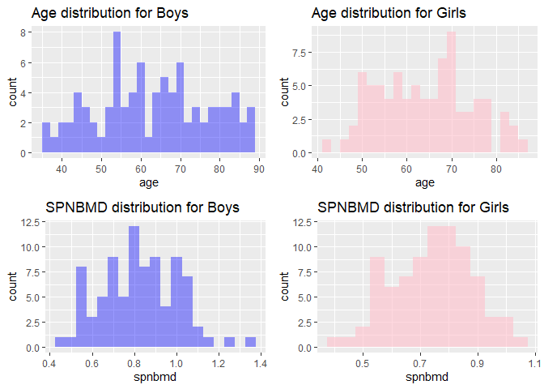
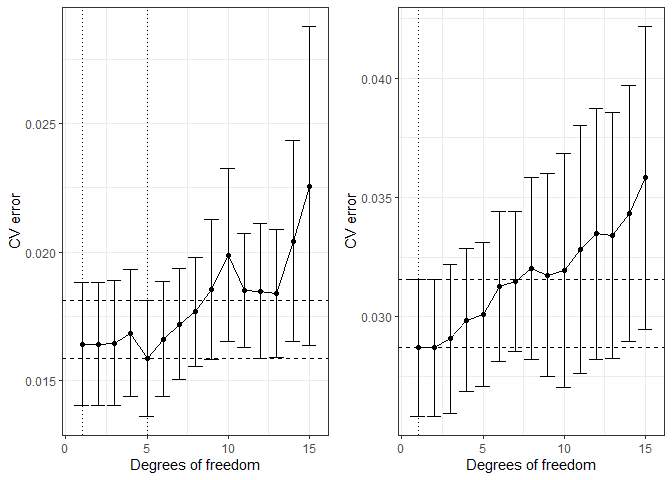
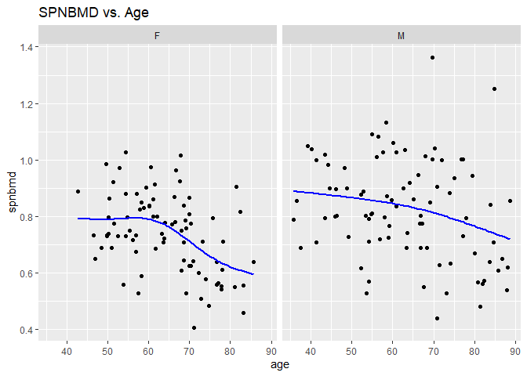
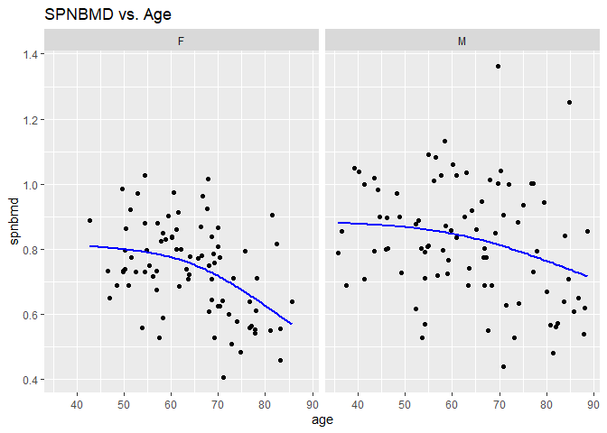
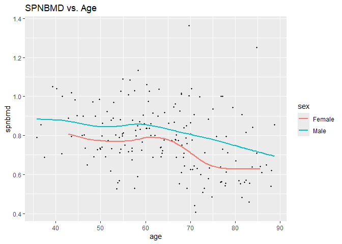
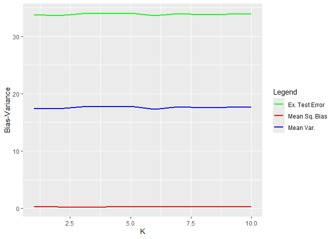
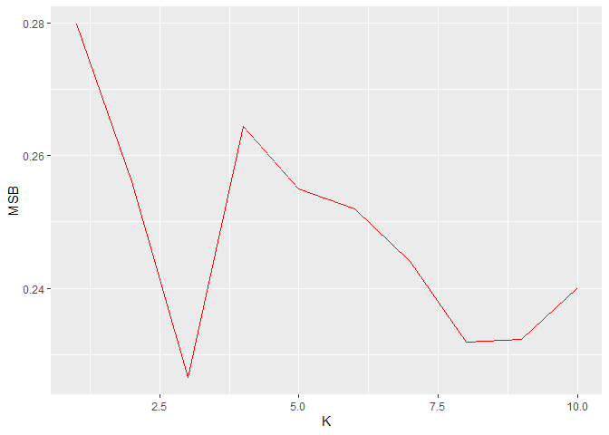
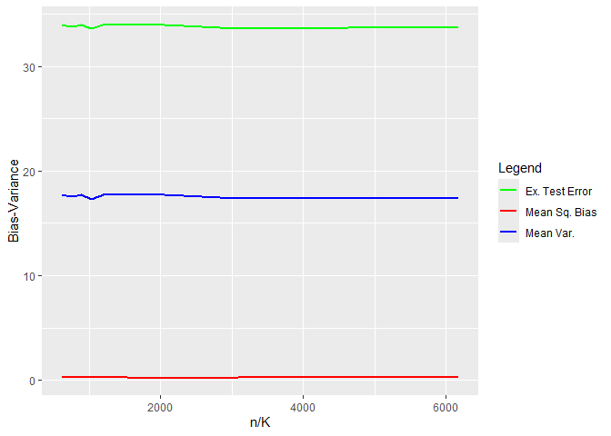
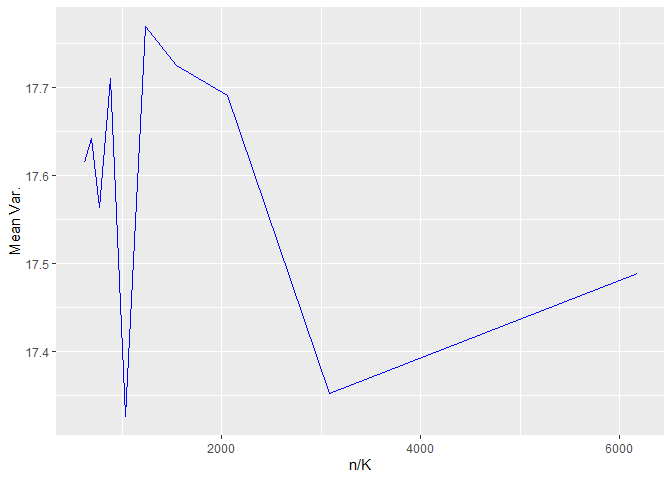
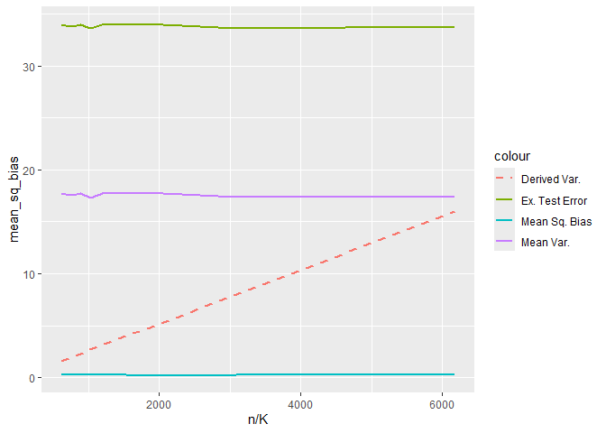

DSC1107\| FA 4
================
Baybayon, Darlyn Antoinette

``` r
suppressPackageStartupMessages({
  library(tidyverse)
  library(dplyr)
  library(readxl)
  library(knitr)
  library(kableExtra)
  library(cowplot)
  library(FNN)
  library(stat471)
  library(splines)
  library(caret)
  library(tibble)
})
```

### 1 Case Study: Bone Mineral Density

#### 1.1 Import

``` r
bmd_raw <- read_excel("bmd-data.xlsx")
print(bmd_raw)
```

    ## # A tibble: 169 × 9
    ##    idnum   age sex   fracture weight_kg height_cm medication waiting_time spnbmd
    ##    <dbl> <dbl> <chr> <chr>        <dbl>     <dbl> <chr>             <dbl>  <dbl>
    ##  1   469  57.1 F     no frac…        64      156. Anticonvu…           18  0.879
    ##  2  8724  75.7 F     no frac…        78      162  No medica…           56  0.795
    ##  3  6736  70.8 M     no frac…        73      170. No medica…           10  0.907
    ##  4 24180  78.2 F     no frac…        60      148  No medica…           14  0.711
    ##  5 17072  54.2 M     no frac…        55      161  No medica…           20  0.791
    ##  6  3806  77.2 M     no frac…        65      168  No medica…            7  0.730
    ##  7 17106  56.2 M     no frac…        77      159  No medica…           26  1.01 
    ##  8 23834  49.9 F     no frac…        59      150  No medica…            9  0.731
    ##  9  2454  68.4 M     no frac…        64      167  Glucocort…            6  0.689
    ## 10  2088  66.3 M     no frac…        72      160. No medica…           10  0.947
    ## # ℹ 159 more rows

#### 1.2 Tidy

What should be the variables in the data? What operation is necessary to
get it into tidy format?

``` r
bmd <- bmd_raw %>%
  select(age,sex,spnbmd)

bmd
```

    ## # A tibble: 169 × 3
    ##      age sex   spnbmd
    ##    <dbl> <chr>  <dbl>
    ##  1  57.1 F      0.879
    ##  2  75.7 F      0.795
    ##  3  70.8 M      0.907
    ##  4  78.2 F      0.711
    ##  5  54.2 M      0.791
    ##  6  77.2 M      0.730
    ##  7  56.2 M      1.01 
    ##  8  49.9 F      0.731
    ##  9  68.4 M      0.689
    ## 10  66.3 M      0.947
    ## # ℹ 159 more rows

**The variables in this data are idnum, age, sex, weight_kg, height_cm,
medication, fracture, waiting_time, and spnbmd. This table is already in
a tidy format where each variable has its own column, each row is unique
and pertains to a single observation, and each value has its own cell.
We may remove other columns that will be irrelevant to the following
analysis.**

#### 1.3 Explore

1.  What is the total number of children in this dataset? What are the
    number of boys and girls? What are the median ages of these boys and
    girls?

**Solution**

``` r
bmd %>%
  count()
```

    ## # A tibble: 1 × 1
    ##       n
    ##   <int>
    ## 1   169

``` r
bmd %>%
  count(sex)
```

    ## # A tibble: 2 × 2
    ##   sex       n
    ##   <chr> <int>
    ## 1 F        83
    ## 2 M        86

``` r
bmd %>% 
  group_by(sex)%>%
  summarise(median_age = median(age))
```

    ## # A tibble: 2 × 2
    ##   sex   median_age
    ##   <chr>      <dbl>
    ## 1 F           63.8
    ## 2 M           63.2

**There are 169 children in this dataset. 83 girls and 86 boys are
recorded with median ages 63.77 and 63.23 years, respectively.**

2.  Produce plots to compare the distributions of spnbmd and age between
    boys and girls (display these as two plots side by side, one for
    spnbmd and one for age). Are there apparent differences in either
    spnbmd or age between these two groups?

``` r
age_plot_m <- bmd %>% filter(sex =="M") %>%
  ggplot(aes(x=age)) + geom_histogram(binwidth = 2, fill="blue", alpha= 0.4) +
  labs(title="Age distribution for Boys")

age_plot_f <- bmd %>% filter(sex =="F") %>%
  ggplot(aes(x=age)) + geom_histogram(binwidth = 2, fill="pink", alpha= 0.6) + 
  labs(title="Age distribution for Girls")


spnbmd_plot_m <- bmd %>% filter(sex =="M") %>%
  ggplot(aes(x=spnbmd)) + geom_histogram(fill="blue", alpha= 0.4, binwidth = 0.05) +
  labs(title="SPNBMD distribution for Boys")


spnbmd_plot_f <- bmd %>% filter(sex =="F") %>%
  ggplot(aes(x=spnbmd)) + geom_histogram(binwidth = 0.05, fill="pink", alpha= 0.6) + 
  labs(title="SPNBMD distribution for Girls")

plot_grid(age_plot_m, age_plot_f, spnbmd_plot_m, spnbmd_plot_f, ncol = 2)
```

<!-- -->

**Age distribution for boys and girls are both irregularly shaped.
SPNBMD distribution is slightly symmetrical for girls and has multiple
peaks for boys.**

3.  Create a scatter plot of spnbmd (y axis) versus age (x axis),
    faceting by gender. What trends do you see in this data?

``` r
ggplot(bmd, aes(x=age, y=spnbmd)) +
  geom_point() + geom_smooth(method="lm", se=FALSE, formula =y~x) + facet_wrap(~sex) +
  labs(title = "SPNBMD vs. Age")
```

<!-- -->

**SPNBMD and age appears to have a negative correlation with age. More
low values of bone mineral density occur for greater ages. The
correlation also appears to be more negative among girls**

#### 1.4 Model

##### 1.4.1 Split

1.  Split bmd into training (80%) and test (20%) sets, using the rows in
    train_samples below for training. Store these in tibbles called
    bmd_train and bmd_test, respectively.

``` r
set.seed(5)
n <- nrow(bmd)
train_samples <- sample(1:n, round(0.8*n))

bmd_train <- bmd[train_samples, ]
bmd_test <- bmd[-train_samples, ]
```

##### 1.4.2 Tune

1.  Since the trends in spnbmd look somewhat different for boys than for
    girls, we might want to fit separate splines to these two groups.
    Separate bmd_train into bmd_train_male and bmd_train_female, and
    likewise for bmd_test.

``` r
bmd_train_male <- bmd_train %>%
  filter(sex == "M")

bmd_train_female <- bmd_train %>%
  filter(sex == "F")

bmd_test_male <- bmd_test %>%
  filter(sex == "M")

bmd_test_female <- bmd_test %>%
  filter(sex == "F")
```

2.  Using cross_validate_spline from the stat471 R package, perform
    10-fold cross-validation on bmd_train_male and bmd_train_female,
    trying degrees of freedom 1,2,. . . ,15. Display the two resulting
    CV plots side by side.

**Solution**

``` r
cv_results_m <- cross_validate_spline(
  x = bmd_train_male$age,
  y = bmd_train_male$spnbmd,
  nfolds=10,
  df_values = 1:15
)
```

    ## Warning in splines::ns(x, df = 0): 'df' was too small; have used 1
    ## Warning in splines::ns(x, df = 0): 'df' was too small; have used 1
    ## Warning in splines::ns(x, df = 0): 'df' was too small; have used 1
    ## Warning in splines::ns(x, df = 0): 'df' was too small; have used 1
    ## Warning in splines::ns(x, df = 0): 'df' was too small; have used 1
    ## Warning in splines::ns(x, df = 0): 'df' was too small; have used 1
    ## Warning in splines::ns(x, df = 0): 'df' was too small; have used 1
    ## Warning in splines::ns(x, df = 0): 'df' was too small; have used 1
    ## Warning in splines::ns(x, df = 0): 'df' was too small; have used 1
    ## Warning in splines::ns(x, df = 0): 'df' was too small; have used 1

``` r
cv_results_f <- cross_validate_spline(
  x = bmd_train_female$age,
  y = bmd_train_female$spnbmd,
  nfolds=10,
  df_values = 1:15)
```

    ## Warning in splines::ns(x, df = 0): 'df' was too small; have used 1
    ## Warning in splines::ns(x, df = 0): 'df' was too small; have used 1
    ## Warning in splines::ns(x, df = 0): 'df' was too small; have used 1
    ## Warning in splines::ns(x, df = 0): 'df' was too small; have used 1
    ## Warning in splines::ns(x, df = 0): 'df' was too small; have used 1
    ## Warning in splines::ns(x, df = 0): 'df' was too small; have used 1
    ## Warning in splines::ns(x, df = 0): 'df' was too small; have used 1
    ## Warning in splines::ns(x, df = 0): 'df' was too small; have used 1
    ## Warning in splines::ns(x, df = 0): 'df' was too small; have used 1
    ## Warning in splines::ns(x, df = 0): 'df' was too small; have used 1

``` r
plot_grid(cv_results_f$cv_plot, cv_results_m$cv_plot)
```

<!-- -->

3.   What are the degrees of freedom values minimizing the CV curve for boys and girls, and what are the values obtained from the one standard error rule?

``` r
cv_results_f$df.min
```

    ## [1] 5

``` r
cv_results_m$df.min
```

    ## [1] 1

``` r
cv_results_f$df.1se
```

    ## [1] 1

``` r
cv_results_m$df.1se
```

    ## [1] 1

4.   For the sake of simplicity, let’s use the same degrees of freedom for males as well as females. Define df.min to be the maximum of the two df.min values for males and females, and define df.1se likewise. Add these two spline fits to the scatter plot of spnbmd (y axis) versus age (x axis), faceting by gender.

``` r
df.min <- max(cv_results_m$df.min, cv_results_f$df.min)
df.1se <- max(cv_results_m$df.1se, cv_results_f$df.1se)

ggplot(bmd, aes(x = age, y = spnbmd)) +
  geom_point() +
  geom_smooth(method = "gam", formula = y ~ s(x, k = df.min), se = FALSE, color = "blue") +
  facet_wrap(~sex) +
  labs(title = "SPNBMD vs. Age")
```

<!-- -->

``` r
ggplot(bmd, aes(x = age, y = spnbmd)) +
  geom_point() +
  geom_smooth(method = "gam", formula = y ~ s(x, k = df.1se), se = FALSE, color = "blue") +
  facet_wrap(~sex) +
  labs(title = "SPNBMD vs. Age")
```

    ## Warning in smooth.construct.tp.smooth.spec(object, dk$data, dk$knots): basis dimension, k, increased to minimum possible
    ## Warning in smooth.construct.tp.smooth.spec(object, dk$data, dk$knots): basis dimension, k, increased to minimum possible

<!-- -->

5.  Given your intuition for what growth curves look like, which of
    these two values of the degrees of freedom makes more sense?

df = 5

##### 1.4.3 Final fit

1.  Using the degrees of freedom chosen above, fit final spline models
    to bmd_train_male and bmd_train_female.

``` r
final_spline_m <- lm(spnbmd ~ ns(age, df = df.min), data = bmd_train_male)

final_spline_f <- lm(spnbmd ~ ns(age, df = df.min), data = bmd_train_female)
```

#### 1.5 Evaluate

1.  Using the final models above, answer the following questions for
    boys and girls separately: What is the training RMSE? What is the
    test RMSE? Print these metrics in a nice table.

``` r
train_rmse_m <- sqrt(mean((bmd_train_male$spnbmd - predict(final_spline_m, bmd_train_male))^2))
test_rmse_m <- sqrt(mean((bmd_test_male$spnbmd - predict(final_spline_m, bmd_test_male))^2))

train_rmse_f <- sqrt(mean((bmd_train_female$spnbmd - predict(final_spline_f, bmd_train_female))^2))
test_rmse_f <- sqrt(mean((bmd_test_female$spnbmd - predict(final_spline_f, bmd_test_female))^2))

rmse_table<- data.frame(
  gender <- c("Male", "Female"),
  training_rmse <- c(train_rmse_m, train_rmse_f),
  test_rmse <- c(test_rmse_m, test_rmse_f)
)

kable(rmse_table, col.names = c("Gender", "Training RMSE", "Test RMSE"))
```

| Gender | Training RMSE | Test RMSE |
|:-------|--------------:|----------:|
| Male   |     0.1593791 | 0.2155728 |
| Female |     0.1157078 | 0.1272295 |

2.  How do the training and test errors compare? What does this suggest
    about the extent of overfitting that has occurred?

**There is a small difference in test and training errors which suggests
minimal overfitting.**

#### 1.6 Interpret

1.   Using the degrees of freedom chosen above, redo the scatter plot with the overlaid spline fits, this time without faceting in order to directly compare the spline fits for boys and girls. Instead of faceting, distinguish the genders by color.

``` r
spline_male <- smooth.spline(bmd_train_male$age, bmd_train_male$spnbmd, df = df.min)
spline_female <- smooth.spline(bmd_train_female$age, bmd_train_female$spnbmd, df = df.min)
ggplot(bmd, aes(x=age, y=spnbmd)) +
  geom_point(size=0.8) + 
  geom_line(data = data.frame(age = spline_male$x, spnbmd = spline_male$y, sex = "Male"), aes(x = age, y = spnbmd, color = sex), size=1) +
  geom_line(data = data.frame(age = spline_female$x, spnbmd = spline_female$y, sex = "Female"), aes(x = age, y = spnbmd, color = sex), size=1) +
  labs(title = "SPNBMD vs. Age")
```

    ## Warning: Using `size` aesthetic for lines was deprecated in ggplot2 3.4.0.
    ## ℹ Please use `linewidth` instead.
    ## This warning is displayed once every 8 hours.
    ## Call `lifecycle::last_lifecycle_warnings()` to see where this warning was
    ## generated.

<!-- -->

2.  The splines help us see the trend in the data much more clearly.
    Eyeballing these fitted curves, answer the following questions. At
    what ages (approximately) do boys and girls reach the peaks of their
    growth spurts? At what ages does growth largely level off for boys
    and girls? Do these seem in the right ballpark?

**At about 60-65 units old, girls reach the peak of their growth spurts,
while boys reach theirs at around 40 and 50-60. After 60, boys’ spnbmd
steadily decrease, while girls’ drop comparatively faster before
becoming steady. These do not seem accurate to what is usually observed
in real life. It is common for girls to get their growth spurts earlier
and faster while boys can get theirs really late.**

### 2 KNN and Bias-Variance Tradeoff

You own a square apple orchard, measuring 200 meters on each side. You
have planted trees in a grid ten meters apart from each other. Last
apple season, you measured the yield of each tree in your orchard (in
average apples per week). You noticed that the yield of the different
trees seems to be higher in some places of the orchard and lower in
others, perhaps due to differences in sunlight and soil fertility across
the orchard. Unbeknownst to you, the yield Y of the tree planted E1
meters to the right and E2 meters up from the bottom left-hand corner of
the orchard has distribution Y = ƒ (E) + ϵ, where

f(E)=50+0.001E_1<sup>2+0.001E_2</sup>2,ϵ~N(0,σ^2 ),σ=4.

#### 2.1 A simple rule to predict this season’s yield

This apple season is right around the corner, and you’d like to predict
the yield of each tree. You come up with perhaps the simplest possible
prediction rule: predict this year’s yield for any given tree based on
last year’s yield from that same tree.

Without doing any programming, answer the following questions:

1.  What is the training error of such a rule? Since the predicted value
    would be the same from last year, the training error would be 0.


2.  What is the mean squared bias, mean variance, and expected test
    error of this prediction rule?


3.  Why is this not the best possible prediction rule?

It has a very high test error

#### 2.2 K-nearest neighbors regression (conceptual)

As a second attempt to predict a yield for each tree, you average
together last year’s yields of the K trees closest to it (including
itself, and breaking ties randomly if necessary). So if you choose K =
1, you get back the simple rule from the previous section. This more
general rule is called K-nearest neighbors (KNN) regression (see ISLR
p. 105).

KNN is not a parametric model like linear or logistic regression, so it
is a little harder to pin down its degrees of freedom.

1.  What happens to the model complexity as K increases? Why?

**As K increases, model complexity decreases. As K get larger, the model
becomes more stable and less sensitive to the noise. The variability in
the prediction decreases with higher K because we are averaging over
more neighbors.**

2.The degrees of freedom for KNN is sometimes considered n/K, where n is
the training set size. Why might this be the case? \[Hint: consider a
situation where the data are clumped in groups of K.\]

**If the data naturally forms clusters of size K, choosing degrees of
freedom to be n/K can effectively lessen the number of independent
decisions by the model as each group of K would contribute to one mean
value.**

3.  Conceptually, why might increasing K tend to improve the prediction
    rule? What does this have to do with the bias-variance tradeoff?
    **Increasing K would improve the prediction rule if it reduces the
    variance and smooths out the predictions.**

4.  Conceptually, why might increasing K tend to worsen the prediction
    rule? What does this have to do with the bias-variance tradeoff?
    **Increasing K would worsen the prediction rule if it results to
    underfitting and is unable to capture important trends.**

#### 2.3 K-nearest neighbors regression (simulation)

``` r
training_results_summary <- readRDS("training_results_summary.rds") 
training_results_summary
```

    ## # A tibble: 6,174 × 5
    ##        K    X1    X2    bias variance
    ##    <dbl> <dbl> <dbl>   <dbl>    <dbl>
    ##  1     1     0     0 -0.25       16.2
    ##  2     1     0    10  0.14       12.2
    ##  3     1     0    20 -0.523      20.4
    ##  4     1     0    30  0.109      15.6
    ##  5     1     0    40 -0.566      21.4
    ##  6     1     0    50 -0.336      15.9
    ##  7     1     0    60 -1.04       12.4
    ##  8     1     0    70 -0.0213     12.4
    ##  9     1     0    80  0.045      18.3
    ## 10     1     0    90 -0.312      14.7
    ## # ℹ 6,164 more rows

1.  Create a new tibble called overall_results the contains the mean
    squared bias, mean variance, and expected test error for each value
    of K. This tibble should have four columns: K, mean_sq_bias,
    mean_variance, and expected_test_error.

``` r
overall_results<- training_results_summary %>%
  group_by(K) %>%
  summarise(mean_sq_bias = mean(bias^2),
            mean_variance = mean(variance),
            expected_test_error= mean_sq_bias+ mean_variance +16)

overall_results
```

    ## # A tibble: 10 × 4
    ##        K mean_sq_bias mean_variance expected_test_error
    ##    <dbl>        <dbl>         <dbl>               <dbl>
    ##  1     1        0.280          17.5                33.8
    ##  2     2        0.256          17.4                33.6
    ##  3     3        0.227          17.7                33.9
    ##  4     4        0.264          17.7                34.0
    ##  5     5        0.255          17.8                34.0
    ##  6     6        0.252          17.3                33.6
    ##  7     7        0.244          17.7                34.0
    ##  8     8        0.232          17.6                33.8
    ##  9     9        0.232          17.6                33.9
    ## 10    10        0.240          17.6                33.9

2.  Using overall_results, plot the mean squared bias, mean variance,
    and expected test error on the same axes as a function of K. Based
    on this plot, what is the optimal value of K?

``` r
ggplot(overall_results, aes(x=K)) +
  geom_line(aes(y=mean_sq_bias, color="Mean Sq. Bias"), size =1)+
  geom_line(aes(y=expected_test_error, color="Ex. Test Error"), size =1) +
  geom_line(aes(y=mean_variance, color="Mean Var."), size =1) +
  labs(
       x = "K",
       y = "Bias-Variance")+
  scale_color_manual(name = "Legend",
                     values = c("Mean Sq. Bias" = "red",
                                "Ex. Test Error" ="green",
                                "Mean Var." = "blue"
                                ))
```

<!-- -->

3.  We are used to the bias decreasing and the variance increasing when
    going from left to right in the plot. Here, the trend seems to be
    reversed. Why is this the case?

**In the plot, we can see that the bias has very slight changes in
behavior. It generally decreases except for around k=3 to k=4.**

4.  The mean squared bias has a strange bump between K = 1 and K = 5,
    increasing from K = 1 to K = 2 but then decreasing from K = 2 to K
    = 5. Why does this bump occur? \[Hint: Think about the rectangular
    grid configuration of the trees. So for a given tree, the closest
    tree is itself, and then the next closest four trees are the ones
    that are one tree up, down, left, and right from it.\]

``` r
ggplot(overall_results, aes(x=K)) +
  geom_line(aes(y=mean_sq_bias), color="red")+
  labs(
       x = "K",
       y = "MSB")
```

<!-- -->

At K=1, there is 0 bias because the prediction would simply be similar
to the past yield (Y= f(E)+ ϵ). At K=2, the prediction

5.  Based on the information in training_results_summary, which tree and
    which value of K gives the overall highest absolute bias? Does the
    sign of the bias make sense? Why do this particular tree and this
    particular value of K give us the largest absolute bias?

``` r
training_results_summary %>%
  arrange(desc(abs(bias))) %>%
  head(1)
```

    ## # A tibble: 1 × 5
    ##       K    X1    X2  bias variance
    ##   <dbl> <dbl> <dbl> <dbl>    <dbl>
    ## 1     1     0    70 -2.06     13.9

**A tree planted 70m north from the bottom-left corner of the orchard
and K=1 gives the highest absolute bias of -2.059342. The negative bias
implies that the prediction is underestimating the true value. This
might be due to the underlying trend where there tends to be a higher
yield as we go to the top and right side of the orchard.**

6.  Redo the bias-variance plot from part 2, this time putting df = n/K
    on the x-axis. What do we notice about the variance as a function of
    df?

``` r
n= nrow(training_results_summary)

ggplot(overall_results, aes(x=n/K)) +
  geom_line(aes(y=mean_sq_bias, color="Mean Sq. Bias"), size =1)+
  geom_line(aes(y=expected_test_error, color="Ex. Test Error"), size =1) +
  geom_line(aes(y=mean_variance, color="Mean Var."), size =1) +
  labs(
       x = "n/K",
       y = "Bias-Variance")+
  scale_color_manual(name = "Legend",
                     values = c("Mean Sq. Bias" = "red",
                                "Ex. Test Error" ="green",
                                "Mean Var." = "blue"
                                ))
```

<!-- -->

``` r
ggplot(overall_results, aes(x=n/K)) +
  geom_line(aes(y=mean_variance), color="blue")+
  labs(
       x = "n/K",
       y = "Mean Var.")
```

<!-- -->
**The variance fluctuates for lower n/K (high K) and then increases as
n/K becomes greater.**

7.  Derive a formula for the KNN mean variance. \[Hint: First, write
    down an expression for the KNN prediction for a given tree. Then,
    compute the variance of this quantity using the fact that the
    variance of the average of N independent random variables each with
    variance s2 is s2/N . Finally, compute the mean variance by
    averaging over trees.\]


8.  Create a plot like that in part 6, but with the mean variance
    formula from part 7 superimposed as a dashed curve. Do these two
    variance curves match?

``` r
ggplot(overall_results, aes(x=n/K)) +
  geom_line(aes(y=mean_sq_bias, color="Mean Sq. Bias"), size =1)+
  geom_line(aes(y=expected_test_error, color="Ex. Test Error"), size =1) +
  geom_line(aes(y=mean_variance, color="Mean Var."), size =1) +
  geom_line(aes(y=16/K, color="Derived Var."), linetype= "dashed", size = 1)
```

<!-- -->

``` r
  labs(
       x = "n/K",
       y = "Bias-Variance")+
  scale_color_manual(name = "Legend",
                     values = c("Mean Sq. Bias" = "red",
                                "Ex. Test Error" ="green",
                                "Mean Var." = "blue",
                                "Derived Var." = "orange"
                                ))
```

    ## NULL

**The curves did not match.**
