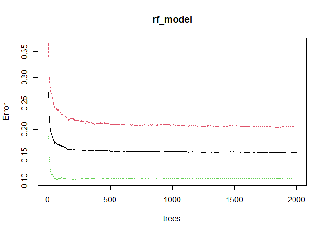

DSC1107 \| SA 1
================
Baybayon, Darlyn Antoinette B.

``` r
suppressPackageStartupMessages({
  library(tidyverse)
  library(dplyr)
  library(readr)
  library(ggplot2)
  library(stat471)
  library(caret)
  library(glmnet)
  library(cowplot)
  library(corrplot)
  library(rpart)
  library(rpart.plot)
  library(randomForest)
  library(broom)
  library(glmnetUtils)
})
```

### Unit 1: R for Data Mining

#### 1. Intro to Modern Data Mining

- Load the dataset and provide an overview of its structure (e.g.,
  dimensions, missing values, types of variables).

- Explain why data mining is important for this dataset.

``` r
dataset <- read_csv("customer_churn.csv", show_col_types = FALSE)

dataset
```

    ## # A tibble: 10,000 × 12
    ##    CustomerID Gender SeniorCitizen Partner Dependents Tenure PhoneService
    ##    <chr>      <chr>          <dbl> <chr>   <chr>       <dbl> <chr>       
    ##  1 CUST00001  Male               0 No      No             65 Yes         
    ##  2 CUST00002  Male               0 No      No             26 Yes         
    ##  3 CUST00003  Male               0 Yes     No             54 Yes         
    ##  4 CUST00004  Female             0 Yes     Yes            70 Yes         
    ##  5 CUST00005  Male               0 No      No             53 Yes         
    ##  6 CUST00006  Female             0 No      Yes            45 Yes         
    ##  7 CUST00007  Female             0 Yes     No             35 Yes         
    ##  8 CUST00008  Female             0 Yes     Yes            20 Yes         
    ##  9 CUST00009  Female             0 Yes     Yes            48 No          
    ## 10 CUST00010  Female             0 No      No             33 Yes         
    ## # ℹ 9,990 more rows
    ## # ℹ 5 more variables: InternetService <chr>, Contract <chr>,
    ## #   MonthlyCharges <dbl>, TotalCharges <dbl>, Churn <chr>

``` r
sapply(dataset, function(x) sum(is.na(x)))
```

    ##      CustomerID          Gender   SeniorCitizen         Partner      Dependents 
    ##               0               0               0               0               0 
    ##          Tenure    PhoneService InternetService        Contract  MonthlyCharges 
    ##               0               0               0               0               0 
    ##    TotalCharges           Churn 
    ##               0               0

``` r
summary(dataset)
```

    ##   CustomerID           Gender          SeniorCitizen      Partner         
    ##  Length:10000       Length:10000       Min.   :0.0000   Length:10000      
    ##  Class :character   Class :character   1st Qu.:0.0000   Class :character  
    ##  Mode  :character   Mode  :character   Median :0.0000   Mode  :character  
    ##                                        Mean   :0.1502                     
    ##                                        3rd Qu.:0.0000                     
    ##                                        Max.   :1.0000                     
    ##   Dependents            Tenure      PhoneService       InternetService   
    ##  Length:10000       Min.   : 0.00   Length:10000       Length:10000      
    ##  Class :character   1st Qu.:17.00   Class :character   Class :character  
    ##  Mode  :character   Median :35.00   Mode  :character   Mode  :character  
    ##                     Mean   :35.22                                        
    ##                     3rd Qu.:53.00                                        
    ##                     Max.   :71.00                                        
    ##    Contract         MonthlyCharges    TotalCharges       Churn          
    ##  Length:10000       Min.   : 20.02   Min.   :   0.0   Length:10000      
    ##  Class :character   1st Qu.: 44.88   1st Qu.: 961.2   Class :character  
    ##  Mode  :character   Median : 70.56   Median :2025.6   Mode  :character  
    ##                     Mean   : 70.18   Mean   :2455.8                     
    ##                     3rd Qu.: 95.77   3rd Qu.:3611.0                     
    ##                     Max.   :119.99   Max.   :8425.6

The dataset contains 10,000 observations (rows) with 12 features
(columns) including numerical and categorical variables. The features
include CustomerID, Gender, SeniorCitizen, Partner, Dependents, Tenure,
PhoneService, InternetService, Contract, MonthlyCharges, TotalCharges,
and Churn. These are information on the customers’ demographics,
contract details, service charges, and whether they have churned or not.
No null values are found in this dataset. Customer retention is an
important business metric, thus, predicting customer churn is vital for
business growth. Data mining would be very helpful in order to better
understand the customers and analyze churn trends so that the company
may improve customer retention.

#### 2. Data Visualization

- Create at least three meaningful visualizations to explore
  relationships in the data (e.g., churn rate by tenure, service type,
  or monthly charges).

- Provide insights based on the visualizations.

``` r
plot_grid(
  ggplot(dataset, aes(x = Churn)) +
  geom_bar(aes(fill = Churn)) + coord_flip(),
  
  ggplot(dataset, aes(x = InternetService)) +
  geom_bar(aes(fill = Churn)) + coord_flip() ,
  
  ggplot(dataset, aes(x = SeniorCitizen)) +
  geom_bar(aes(fill = Churn)) + coord_flip(),
  
  ggplot(dataset, aes(x = Gender)) +
  geom_bar(aes(fill = Churn)) + coord_flip() ,
  
  
  ncol = 2 
)
```

<!-- -->

``` r
dataset %>%
  group_by(Tenure) %>%
  summarize(
    Churn_rate = mean(as.numeric(Churn=="Yes"), na.rm=TRUE)
  ) %>% 
  ggplot(aes(x=Tenure, y=Churn_rate)) +geom_point() +
  geom_smooth(se=FALSE, method = "lm")
```

    ## `geom_smooth()` using formula = 'y ~ x'

<!-- -->

Majority of the customers have not churned yet. There are slightly more
Fiber optic users from the customers subscribed to an internet service.
Non-Senior Citizens make up most of the customers. There are slightly
more female customers than male. For the categories shown, the trend
remains that more customers have not churned. Meanhwile, the plot of
Churn Rate vs. Tenure shows a slightly positive relationship between
these variables.

#### 3. Data Transformation

- Handle missing values appropriately.

- Convert categorical variables into factor variables.

- Normalize or standardize numerical features where necessary.

``` r
dataset <- dataset %>%
  select(-CustomerID) %>%
  mutate(
    Partner = if_else(Partner == "No", 0, 1),
    Dependents = if_else(Dependents == "No", 0, 1),
    PhoneService = if_else(PhoneService == "No", 0, 1),
    Churn = if_else(Churn == "No", 0, 1),
    across(c(Gender,Partner, Dependents, PhoneService, InternetService, Contract, Churn), as.factor)
    )

head(dataset)
```

    ## # A tibble: 6 × 11
    ##   Gender SeniorCitizen Partner Dependents Tenure PhoneService InternetService
    ##   <fct>          <dbl> <fct>   <fct>       <dbl> <fct>        <fct>          
    ## 1 Male               0 0       0              65 1            Fiber optic    
    ## 2 Male               0 0       0              26 1            Fiber optic    
    ## 3 Male               0 1       0              54 1            Fiber optic    
    ## 4 Female             0 1       1              70 1            DSL            
    ## 5 Male               0 0       0              53 1            DSL            
    ## 6 Female             0 0       1              45 1            Fiber optic    
    ## # ℹ 4 more variables: Contract <fct>, MonthlyCharges <dbl>, TotalCharges <dbl>,
    ## #   Churn <fct>

#### 4. Data Wrangling

- Filter data to remove outliers.

- Create new derived variables that may help in predictive modeling.

- Aggregate or summarize data if necessary.

``` r
data_long <- dataset %>%
  pivot_longer(cols = c('Tenure', 'MonthlyCharges', 'TotalCharges'), 
               names_to = 'Variable', 
               values_to = 'Value')


ggplot(data = data_long, mapping = aes(x = Value, fill = Variable)) +
  geom_boxplot(alpha=0.6) +
  facet_wrap(~Variable, ncol = 3, scales="free_x") 
```

<!-- -->

Outliers in TotalCharges will be removed.

``` r
quantiles <- quantile(dataset$TotalCharges, probs = c(0.25, 0.75))
lower_bound <- quantiles[1] - 1.5 * (quantiles[2] - quantiles[1])
upper_bound <- quantiles[2] + 1.5 * (quantiles[2] - quantiles[1])

data_clean <- dataset %>%
  filter(TotalCharges >= lower_bound & TotalCharges <= upper_bound) %>%
  mutate(
    SpendingLevel = factor(case_when(
    TotalCharges <= quantile(TotalCharges, 0.33, na.rm = TRUE) ~ "Low",
    TotalCharges <= quantile(TotalCharges, 0.67, na.rm = TRUE) ~ "Medium",
    TRUE ~ "High")),
    TenureGroup = cut(Tenure, 
                          breaks =  c(0, 12, 24, 36, 48, 60, 71), 
                          labels = c("Short-term", "1-2 years", "2-3 years", "3-4 years", "4-5 years", "5+ years"),
                          include.lowest = TRUE))


head(data_clean)
```

    ## # A tibble: 6 × 13
    ##   Gender SeniorCitizen Partner Dependents Tenure PhoneService InternetService
    ##   <fct>          <dbl> <fct>   <fct>       <dbl> <fct>        <fct>          
    ## 1 Male               0 0       0              65 1            Fiber optic    
    ## 2 Male               0 0       0              26 1            Fiber optic    
    ## 3 Male               0 1       0              54 1            Fiber optic    
    ## 4 Female             0 1       1              70 1            DSL            
    ## 5 Male               0 0       0              53 1            DSL            
    ## 6 Female             0 0       1              45 1            Fiber optic    
    ## # ℹ 6 more variables: Contract <fct>, MonthlyCharges <dbl>, TotalCharges <dbl>,
    ## #   Churn <fct>, SpendingLevel <fct>, TenureGroup <fct>

``` r
summary_tenure<- data_clean %>%
  group_by(TenureGroup) %>%
  summarize(
    ChurnRate = mean((Churn == 1), na.rm = TRUE),
    MeanTotalCharges = mean(TotalCharges, na.rm = TRUE),
    TotalCustomers = n()
  )
summary_tenure
```

    ## # A tibble: 6 × 4
    ##   TenureGroup ChurnRate MeanTotalCharges TotalCustomers
    ##   <fct>           <dbl>            <dbl>          <int>
    ## 1 Short-term      0.269             418.           1860
    ## 2 1-2 years       0.275            1322.           1672
    ## 3 2-3 years       0.259            2168.           1612
    ## 4 3-4 years       0.268            3023.           1724
    ## 5 4-5 years       0.271            3734.           1652
    ## 6 5+ years        0.287            4350.           1408

``` r
summary_spend<- data_clean %>%
  group_by(SpendingLevel) %>%
  summarize(
    ChurnRate = mean((Churn == 1), na.rm = TRUE),
    MeanTotalCharges = mean(TotalCharges, na.rm = TRUE),
    TotalCustomers = n()
  )
summary_spend
```

    ## # A tibble: 3 × 4
    ##   SpendingLevel ChurnRate MeanTotalCharges TotalCustomers
    ##   <fct>             <dbl>            <dbl>          <int>
    ## 1 High              0.274            4582.           3276
    ## 2 Low               0.270             622.           3276
    ## 3 Medium            0.268            2056.           3376

``` r
summary_churn <- data_clean %>%
  group_by(Churn) %>%
  summarise(
    MeanTenure = mean(Tenure, na.rm = TRUE),
    MedianCharges = median(MonthlyCharges, na.rm = TRUE),
    TotalCharges = sum(MonthlyCharges, na.rm = TRUE),
    Count = n(),
    MinTenure = min(Tenure, na.rm = TRUE),
    MaxTenure = max(Tenure, na.rm = TRUE),
    SDTenure = sd(Tenure, na.rm = TRUE)
  )
summary_churn
```

    ## # A tibble: 2 × 8
    ##   Churn MeanTenure MedianCharges TotalCharges Count MinTenure MaxTenure SDTenure
    ##   <fct>      <dbl>         <dbl>        <dbl> <int>     <dbl>     <dbl>    <dbl>
    ## 1 0           34.9          70.5      506122.  7237         0        71     20.6
    ## 2 1           35.2          69.6      187333.  2691         0        71     20.8

#### 5. Review

- Summarize key takeaways from the exploratory data analysis process.

More customers in the dataset have not churned yet, however there is
still a significant portion of those who have. Churn Rate increase
slightly with longer Tenure periods. The number of customers also
declines with longer Tenure.

### Unit 2: Tuning Predictive Models

``` r
set.seed(123)

data_clean <- data_clean %>% select(-SpendingLevel, -TenureGroup)
table(data_clean$Churn)
```

    ## 
    ##    0    1 
    ## 7237 2691

``` r
#oversample churn =1 
data_clean <- upSample(x = data_clean[, -ncol(data_clean)], y = data_clean$Churn)

table(data_clean$Class)
```

    ## 
    ##    0    1 
    ## 7237 7237

``` r
n <- nrow(data_clean)
train_samples <- sample(1:n, round(0.8*n))

data_train <- data_clean[train_samples, ]
data_test <- data_clean[-train_samples, ]
```

#### 6. Model Complexity

- Fit a decision tree and logistic regression model.

- Compare their complexities and explain trade-offs.

``` r
model_tree <- rpart(Class ~ ., data = data_train, method = "class", control=rpart.control(cp=.0001, maxdepth = 7))
# summary(model_tree)
rpart.plot(model_tree, cex=0.5)
```

<!-- -->

``` r
model_logistic <- glm(Class ~ ., data=data_train, family=binomial)
summary(model_logistic)
```

    ## 
    ## Call:
    ## glm(formula = Class ~ ., family = binomial, data = data_train)
    ## 
    ## Coefficients:
    ##                              Estimate Std. Error z value Pr(>|z|)    
    ## (Intercept)                 2.993e-01  1.173e-01   2.551  0.01074 *  
    ## GenderMale                 -5.837e-02  3.733e-02  -1.564  0.11790    
    ## SeniorCitizen              -7.140e-02  5.222e-02  -1.367  0.17151    
    ## Partner1                   -8.295e-02  3.731e-02  -2.223  0.02619 *  
    ## Dependents1                -8.633e-02  4.090e-02  -2.111  0.03479 *  
    ## Tenure                      3.993e-03  2.355e-03   1.695  0.09003 .  
    ## PhoneService1              -2.799e-01  6.086e-02  -4.600 4.23e-06 ***
    ## InternetServiceFiber optic -2.484e-02  4.153e-02  -0.598  0.54984    
    ## InternetServiceNo          -1.216e-01  5.177e-02  -2.349  0.01884 *  
    ## ContractOne year           -1.473e-01  4.866e-02  -3.027  0.00247 ** 
    ## ContractTwo year            6.199e-02  4.783e-02   1.296  0.19499    
    ## MonthlyCharges              1.108e-03  1.295e-03   0.856  0.39193    
    ## TotalCharges               -4.659e-05  3.186e-05  -1.462  0.14373    
    ## ---
    ## Signif. codes:  0 '***' 0.001 '**' 0.01 '*' 0.05 '.' 0.1 ' ' 1
    ## 
    ## (Dispersion parameter for binomial family taken to be 1)
    ## 
    ##     Null deviance: 16052  on 11578  degrees of freedom
    ## Residual deviance: 15995  on 11566  degrees of freedom
    ## AIC: 16021
    ## 
    ## Number of Fisher Scoring iterations: 3

Logistic regression assumes linear relationship between the variables.
It has lower model complexity and is prone to underfitting and failing
to capture all patterns in the data. In comparison, decision trees are
more complex and can capture non-linear relationships. It can capture
more information the more complex it is but with the risk of
overfitting.

#### 7. Bias-Variance Trade-Off

- Explain the concept of bias-variance trade-off in the context of the
  models trained.

- Discuss how model complexity affects performance.

The bias-variance trade-off describes the relationship between a model’s
complexity and accuracy. It implies that the as we increase the model
complexity, its variance increases, and bias decreases. Performance
improves with greater complexity but only up to some point where it
starts to overfit. It is crucial to find the correct balance between
bias and variance to avoid overfitting and underfitting. Logistic
regression generally has high bias and low variance as it is a simple
linear model while decision trees can reduce bias and increase variance
with higher depth.

#### 8. Cross-Validation

- Use k-fold cross-validation (k=10) to evaluate model performance.

- Report and interpret accuracy, precision, recall, and F1-score.

``` r
train_control <- trainControl(method = "cv", number = 10)

cv_model <- train(Class ~., data = data_train, 
               method = "glm",
               family= "binomial",
               trControl = train_control)
cv_model
```

    ## Generalized Linear Model 
    ## 
    ## 11579 samples
    ##    10 predictor
    ##     2 classes: '0', '1' 
    ## 
    ## No pre-processing
    ## Resampling: Cross-Validated (10 fold) 
    ## Summary of sample sizes: 10421, 10421, 10420, 10421, 10422, 10420, ... 
    ## Resampling results:
    ## 
    ##   Accuracy   Kappa     
    ##   0.5179189  0.03582669

``` r
classification_metrics(
  test_responses = data_test$Class,
  test_predictions = predict(cv_model, data_test)
)
```

    ## # A tibble: 1 × 5
    ##   misclass_err w_misclass_err precision recall     F
    ##          <dbl> <lgl>              <dbl>  <dbl> <dbl>
    ## 1        0.502 NA                   0.5  0.459 0.479

This model accurately predicts 50.15% of customer churn. Since this is a
binary classification, this accuracy is only slightly better than random
guessing. 50% of the churn instances predicted by the model were truly
positive and correctly identified 45.9% of churn instances. the F score
of F=0.47 suggests that the model exhibited moderate performance,.

#### 9. Classification

- Train a Random Forest classifier to predict customer churn.

- Tune hyperparameters using grid search.

- Report final model performance.

``` r
rf_model <- randomForest(factor(Class) ~. , data=data_train)
plot(rf_model)
```

<!-- -->

``` r
tuneGrid <- expand.grid(.mtry = c(1: 10))
rf_tune <- train(Class~.,
    data = data_train,
    method = "rf",
    metric = "Accuracy",
    tuneGrid = tuneGrid,
    trControl = train_control,
    importance = TRUE,
    nodesize = 14,
    ntree=300)
print(rf_tune)
```

    ## Random Forest 
    ## 
    ## 11579 samples
    ##    10 predictor
    ##     2 classes: '0', '1' 
    ## 
    ## No pre-processing
    ## Resampling: Cross-Validated (10 fold) 
    ## Summary of sample sizes: 10420, 10421, 10420, 10422, 10420, 10422, ... 
    ## Resampling results across tuning parameters:
    ## 
    ##   mtry  Accuracy   Kappa     
    ##    1    0.5444380  0.08897331
    ##    2    0.6055814  0.21125391
    ##    3    0.6822677  0.36458748
    ##    4    0.7282931  0.45660618
    ##    5    0.7496291  0.49926848
    ##    6    0.7544646  0.50894432
    ##    7    0.7613771  0.52276564
    ##    8    0.7627556  0.52552318
    ##    9    0.7631919  0.52639801
    ##   10    0.7620670  0.52414889
    ## 
    ## Accuracy was used to select the optimal model using the largest value.
    ## The final value used for the model was mtry = 9.

``` r
modellist <- list()

for (ntree in c(1000,1500,2000,2500)){
  set.seed(123)
  rf_tune <- train(Class~.,
               data = data_train,
               method = 'rf',
               metric = 'Accuracy',
               tuneGrid = tuneGrid,
               trControl = train_control,
               ntree = ntree)
  key <- toString(ntree)
  modellist[[key]] <- rf_tune
}

results <- resamples(modellist)
summary(results)
```

    ## 
    ## Call:
    ## summary.resamples(object = results)
    ## 
    ## Models: 1000, 1500, 2000, 2500 
    ## Number of resamples: 10 
    ## 
    ## Accuracy 
    ##           Min.   1st Qu.    Median      Mean   3rd Qu.      Max. NA's
    ## 1000 0.7970639 0.8086809 0.8197926 0.8189780 0.8254204 0.8550475    0
    ## 1500 0.7918826 0.8101923 0.8176318 0.8189775 0.8284410 0.8541846    0
    ## 2000 0.7953368 0.8093286 0.8193604 0.8189781 0.8262836 0.8533218    0
    ## 2500 0.7944732 0.8090300 0.8184961 0.8182004 0.8262825 0.8524590    0
    ## 
    ## Kappa 
    ##           Min.   1st Qu.    Median      Mean   3rd Qu.      Max. NA's
    ## 1000 0.5941278 0.6174099 0.6396110 0.6379784 0.6508704 0.7101068    0
    ## 1500 0.5837651 0.6204308 0.6352923 0.6379774 0.6568978 0.7083817    0
    ## 2000 0.5906736 0.6187026 0.6387482 0.6379787 0.6525963 0.7066565    0
    ## 2500 0.5889465 0.6181004 0.6370202 0.6364234 0.6525941 0.7049314    0

Highest accuracy occurs at ntree = 2000 (accuracy = 82.30%)

``` r
rf_model <- randomForest(factor(Class) ~., data=data_train, ntree=2000, mtry=9)

summary(rf_model)
```

    ##                 Length Class  Mode     
    ## call                5  -none- call     
    ## type                1  -none- character
    ## predicted       11579  factor numeric  
    ## err.rate         6000  -none- numeric  
    ## confusion           6  -none- numeric  
    ## votes           23158  matrix numeric  
    ## oob.times       11579  -none- numeric  
    ## classes             2  -none- character
    ## importance         10  -none- numeric  
    ## importanceSD        0  -none- NULL     
    ## localImportance     0  -none- NULL     
    ## proximity           0  -none- NULL     
    ## ntree               1  -none- numeric  
    ## mtry                1  -none- numeric  
    ## forest             14  -none- list     
    ## y               11579  factor numeric  
    ## test                0  -none- NULL     
    ## inbag               0  -none- NULL     
    ## terms               3  terms  call

``` r
plot(rf_model)
```

<!-- -->

``` r
classification_metrics(
  test_responses = data_test$Class,
  test_predictions = predict(rf_model, newdata = data_test, type = "response")
)
```

    ## # A tibble: 1 × 5
    ##   misclass_err w_misclass_err precision recall     F
    ##          <dbl> <lgl>              <dbl>  <dbl> <dbl>
    ## 1        0.153 NA                 0.819  0.890 0.853

### Unit 3: Regression-Based Methods

#### 10. Logistic regression

- Fit a logistic regression model using Churn as the dependent variable
  and Tenure, MonthlyCharges, and TotalCharges as independent variables.

- Interpret the coefficients and assess model significance using
  p-values.

``` r
model_logistic <- glm(Class ~ Tenure + MonthlyCharges + TotalCharges, data=data_train, family=binomial)
summary(model_logistic)
```

    ## 
    ## Call:
    ## glm(formula = Class ~ Tenure + MonthlyCharges + TotalCharges, 
    ##     family = binomial, data = data_train)
    ## 
    ## Coefficients:
    ##                  Estimate Std. Error z value Pr(>|z|)
    ## (Intercept)    -8.398e-02  9.730e-02  -0.863    0.388
    ## Tenure          3.500e-03  2.346e-03   1.492    0.136
    ## MonthlyCharges  7.610e-04  1.289e-03   0.590    0.555
    ## TotalCharges   -3.872e-05  3.173e-05  -1.220    0.222
    ## 
    ## (Dispersion parameter for binomial family taken to be 1)
    ## 
    ##     Null deviance: 16052  on 11578  degrees of freedom
    ## Residual deviance: 16049  on 11575  degrees of freedom
    ## AIC: 16057
    ## 
    ## Number of Fisher Scoring iterations: 3

``` r
# confusionMatrix(logistic_predicted_churn, data_test$Class)
```

A logistic regressiion was performed to assess the effects of Tenure,
MonthlyCharges, and TotalCharges on the likelihood of Churn. None of the
predictors Tenure (B = 9.476e-04, p = 0.793), MonthlyCharges (B =
-3.599e-04, p = 0.686), and TotalCharges (B = 4.315e-06, p = 0.892) was
statistically significant. As assessed by deviance values (Null = 16052,
Residual = 16050), the model fit does not strongly predict Churn. It can
be inferred that the chosen predictors do not have a strong relationship
with the outcome, Churn.

``` r
logistic_predicted_churn <- factor(if_else(predict(model_logistic, newdata = data_test, type="response") > 0.5, 1, 0))
classification_metrics(
  test_responses = data_test$Class,
  test_predictions = logistic_predicted_churn
)
```

    ## # A tibble: 1 × 5
    ##   misclass_err w_misclass_err precision recall     F
    ##          <dbl> <lgl>              <dbl>  <dbl> <dbl>
    ## 1        0.507 NA                 0.491  0.318 0.386

#### 11. Regression in High Dimensions

- Discuss the challenges of high-dimensional regression and potential
  solutions.

- Apply Principal Component Analysis (PCA) on numerical features
  (Tenure, MonthlyCharges, TotalCharges) to reduce dimensionality.

``` r
pca <- scale(data_train %>% select(Tenure, MonthlyCharges, TotalCharges))

pca_model <- prcomp(pca, center = TRUE, scale. = TRUE)

summary(pca_model)
```

    ## Importance of components:
    ##                           PC1    PC2     PC3
    ## Standard deviation     1.3776 1.0241 0.23102
    ## Proportion of Variance 0.6326 0.3496 0.01779
    ## Cumulative Proportion  0.6326 0.9822 1.00000

``` r
#total variance explained by each principal component
pca_model$sdev^2 / sum(pca_model$sdev^2)
```

    ## [1] 0.63259131 0.34961817 0.01779052

High-dimensional regression is often prone to overfitting and need high
computational power. We may alleviate this issue by regularization and
choosing optimal model complexity by cross validation.

In the PCA Analysis, we find that PC1 and PC2 explain the majority of
variance in the data.

``` r
pca_transformed <- as.data.frame(pca_model$x)
  
data_train_pca <- cbind(data_train, pca_transformed)
head(data_train_pca)
```

    ##       Gender SeniorCitizen Partner Dependents Tenure PhoneService
    ## 669     Male             0       0          0     12            1
    ## 8571    Male             0       0          1     42            1
    ## 3200    Male             0       1          0     55            1
    ## 13208 Female             1       0          0      1            1
    ## 3420    Male             0       1          0     59            1
    ## 12763 Female             0       0          0     25            1
    ##       InternetService       Contract MonthlyCharges TotalCharges Class
    ## 669       Fiber optic Month-to-month          90.40      1084.80     0
    ## 8571              DSL       Two year          91.86      3858.12     1
    ## 3200              DSL       Two year          86.10      4735.50     0
    ## 13208             DSL       One year          59.75        59.75     1
    ## 3420               No Month-to-month          45.11      2661.49     0
    ## 12763             DSL Month-to-month          65.51      1637.75     1
    ##              PC1         PC2         PC3
    ## 669   -0.9040490  1.20838403  0.16759107
    ## 8571   1.0662336  0.46772778 -0.04582558
    ## 3200   1.7057746 -0.04068913 -0.10482756
    ## 13208 -2.0293660  0.61436388 -0.18700623
    ## 3420   0.4470004 -1.35126939  0.21990136
    ## 12763 -0.6477960  0.14642797 -0.04233828

``` r
lm_pca <- glm(Class ~ PC1 +PC2, data = data_train_pca, family="binomial")

summary(lm_pca)
```

    ## 
    ## Call:
    ## glm(formula = Class ~ PC1 + PC2, family = "binomial", data = data_train_pca)
    ## 
    ## Coefficients:
    ##              Estimate Std. Error z value Pr(>|z|)
    ## (Intercept) -0.001555   0.018588  -0.084    0.933
    ## PC1          0.001034   0.013493   0.077    0.939
    ## PC2         -0.024366   0.018152  -1.342    0.180
    ## 
    ## (Dispersion parameter for binomial family taken to be 1)
    ## 
    ##     Null deviance: 16052  on 11578  degrees of freedom
    ## Residual deviance: 16050  on 11576  degrees of freedom
    ## AIC: 16056
    ## 
    ## Number of Fisher Scoring iterations: 3

High-dimensional regression is often prone to overfitting and need high
computational power. We may alleviate this issue by regularization and
choosing optimal model complexity by cross validation.

#### 12. Ridge Regression

- Implement Ridge Regression using Churn as the target variable and
  Tenure, MonthlyCharges, TotalCharges, and additional customer
  demographic features as predictors.

- Identify the optimal lambda using cross-validation.

``` r
ridge_fit <- cv.glmnet(
  Class ~ Tenure + MonthlyCharges +TotalCharges + Partner,
  alpha = 0,
  nfolds = 10,
  family= "binomial",
  type.measure = "class",
  data= data_train
)


plot(ridge_fit)
```

<!-- -->

``` r
head(ridge_fit$lambda)
```

    ## [1] 10.148758  9.247170  8.425677  7.677163  6.995145

``` r
head(ridge_fit$cvm)
```

    ## [1] 0.5064341 0.5047068 0.5047068 0.5004750 0.4992659

``` r
head(ridge_fit$cvsd)
```

    ## [1] 0.003867676 0.004576536 0.004454469 0.005884997 0.006121572

``` r
ridge_fit$lambda.min
```

    ## [1] 6.995145

``` r
ridge_fit$lambda.1se
```

    ## [1] 9.24717

``` r
coef_tidy(ridge_fit, s="lambda.min")
```

    ## # A tibble: 6 × 2
    ##   feature          coefficient
    ##   <chr>                  <dbl>
    ## 1 (Intercept)    -0.00100     
    ## 2 Tenure          0.0000310   
    ## 3 MonthlyCharges -0.0000217   
    ## 4 TotalCharges   -0.0000000591
    ## 5 Partner0        0.00271     
    ## 6 Partner1       -0.00271

``` r
coef_tidy(ridge_fit, s="lambda.1se")
```

    ## # A tibble: 6 × 2
    ##   feature          coefficient
    ##   <chr>                  <dbl>
    ## 1 (Intercept)    -0.00113     
    ## 2 Tenure          0.0000236   
    ## 3 MonthlyCharges -0.0000166   
    ## 4 TotalCharges   -0.0000000443
    ## 5 Partner0        0.00208     
    ## 6 Partner1       -0.00208

``` r
plot_glmnet(glmnet_fit = ridge_fit, data= data_train, features_to_plot = 5)
```

<!-- -->

The summaries of coefficients using lambda.min and lambda.1se are
displayed above. The coefficients obtained using lambda.min are larger
compared to lambda.1se. Tenure has the greatest statistical influence on
the predictions among other oredictors. Its sign implies that customers
become more likely to Churn after longer Tenure periods. The least
relevant predictor is TotalCharges with the smaallest coefficient.

``` r
ridge_pred <- (predict(ridge_fit, newdata= data_test,
                       s="lambda.min", type="response"))
                   
ridge_pred_class <- factor((if_else(ridge_pred > 0.5, 1, 0)))

RMSE <- sqrt(mean((as.numeric(ridge_pred) - as.numeric(data_test$Class))^2))
RMSE
```

    ## [1] 1.119789

``` r
confusionMatrix(ridge_pred_class, data_test$Class)
```

    ## Confusion Matrix and Statistics
    ## 
    ##           Reference
    ## Prediction   0   1
    ##          0 774 839
    ##          1 669 613
    ##                                           
    ##                Accuracy : 0.4791          
    ##                  95% CI : (0.4608, 0.4975)
    ##     No Information Rate : 0.5016          
    ##     P-Value [Acc > NIR] : 0.9926          
    ##                                           
    ##                   Kappa : -0.0414         
    ##                                           
    ##  Mcnemar's Test P-Value : 1.349e-05       
    ##                                           
    ##             Sensitivity : 0.5364          
    ##             Specificity : 0.4222          
    ##          Pos Pred Value : 0.4799          
    ##          Neg Pred Value : 0.4782          
    ##              Prevalence : 0.4984          
    ##          Detection Rate : 0.2674          
    ##    Detection Prevalence : 0.5572          
    ##       Balanced Accuracy : 0.4793          
    ##                                           
    ##        'Positive' Class : 0               
    ## 

``` r
classification_metrics(
  test_responses = data_test$Class,
  test_predictions = ridge_pred_class
)
```

    ## # A tibble: 1 × 5
    ##   misclass_err w_misclass_err precision recall     F
    ##          <dbl> <lgl>              <dbl>  <dbl> <dbl>
    ## 1        0.521 NA                 0.478  0.422 0.448

The model has an accuracy of 48.05%, precision of 47.85% and recall of
40%. These indicate poor overall performance of the model.

#### 13. Lasso Regression

- Implement Lasso Regression with the same feature set as Ridge
  Regression.

- Discuss feature selection benefits and interpret the coefficients.

``` r
lasso_fit <- cv.glmnet(
  Class~ Tenure +MonthlyCharges + TotalCharges + Partner,
  alpha=1,
  nfolds = 10,
  family="binomial",
  type.measure="class",
  data = data_train
)

plot(lasso_fit)
```

<!-- -->

``` r
plot_glmnet(lasso_fit, data_train)
```

<!-- -->

``` r
head(lasso_fit$lambda)
```

    ## [1] 0.010148758 0.009247170 0.008425677 0.007677163 0.006995145 0.006373716

``` r
head(lasso_fit$cvm)
```

    ## [1] 0.5098886 0.5054841 0.5009068 0.4957250 0.4898523 0.4898523

``` r
head(lasso_fit$cvsd)
```

    ## [1] 0.002621863 0.002578647 0.002673009 0.003236670 0.003512085 0.003512085

``` r
lasso_fit$lambda.min
```

    ## [1] 0.006995145

``` r
lasso_fit$lambda.1se
```

    ## [1] 0.006995145

``` r
coef_tidy(lasso_fit, s="lambda.min")
```

    ## # A tibble: 6 × 2
    ##   feature        coefficient
    ##   <chr>                <dbl>
    ## 1 (Intercept)      -1.42e- 2
    ## 2 Tenure            0       
    ## 3 MonthlyCharges    0       
    ## 4 TotalCharges      0       
    ## 5 Partner0          2.52e- 2
    ## 6 Partner1         -6.81e-15

``` r
coef_tidy(lasso_fit, s="lambda.1se")
```

    ## # A tibble: 6 × 2
    ##   feature        coefficient
    ##   <chr>                <dbl>
    ## 1 (Intercept)      -1.42e- 2
    ## 2 Tenure            0       
    ## 3 MonthlyCharges    0       
    ## 4 TotalCharges      0       
    ## 5 Partner0          2.52e- 2
    ## 6 Partner1         -6.81e-15

``` r
plot_glmnet(glmnet_fit = lasso_fit, data= data_train, features_to_plot = 5)
```

<!-- -->

The summaries of coefficients using lambda.min and lambda.1se are
displayed above. The coefficients obtained using lambda.min are larger
compared to lambda.1se. Tenure again has the greatest statistical
influence on the predictions among other predictors. Its sign implies
that customers become more likely to Churn after longer Tenure periods.
The least relevant predictor is TotalCharges with the smaallest
coefficient.

``` r
lasso_pred <- (predict(lasso_fit, newdata= data_test,
                       s="lambda.min", type="response"))
                   
lasso_pred_class <- factor((if_else(lasso_pred > 0.5, 1, 0)))

RMSE <- sqrt(mean((as.numeric(lasso_pred) - as.numeric(data_test$Class))^2))
RMSE
```

    ## [1] 1.119825

``` r
confusionMatrix(lasso_pred_class, data_test$Class)
```

    ## Confusion Matrix and Statistics
    ## 
    ##           Reference
    ## Prediction   0   1
    ##          0 690 751
    ##          1 753 701
    ##                                           
    ##                Accuracy : 0.4805          
    ##                  95% CI : (0.4621, 0.4989)
    ##     No Information Rate : 0.5016          
    ##     P-Value [Acc > NIR] : 0.9889          
    ##                                           
    ##                   Kappa : -0.039          
    ##                                           
    ##  Mcnemar's Test P-Value : 0.9794          
    ##                                           
    ##             Sensitivity : 0.4782          
    ##             Specificity : 0.4828          
    ##          Pos Pred Value : 0.4788          
    ##          Neg Pred Value : 0.4821          
    ##              Prevalence : 0.4984          
    ##          Detection Rate : 0.2383          
    ##    Detection Prevalence : 0.4978          
    ##       Balanced Accuracy : 0.4805          
    ##                                           
    ##        'Positive' Class : 0               
    ## 

``` r
classification_metrics(
  test_responses = data_test$Class,
  test_predictions = lasso_pred_class
)
```

    ## # A tibble: 1 × 5
    ##   misclass_err w_misclass_err precision recall     F
    ##          <dbl> <lgl>              <dbl>  <dbl> <dbl>
    ## 1        0.520 NA                 0.482  0.483 0.482

The model has an accuracy of 48.05%, precision of 48.2% and recall of
48.3%. These indicate poor overall performance of the model.
